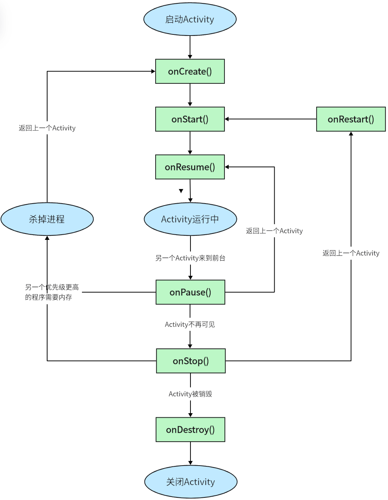
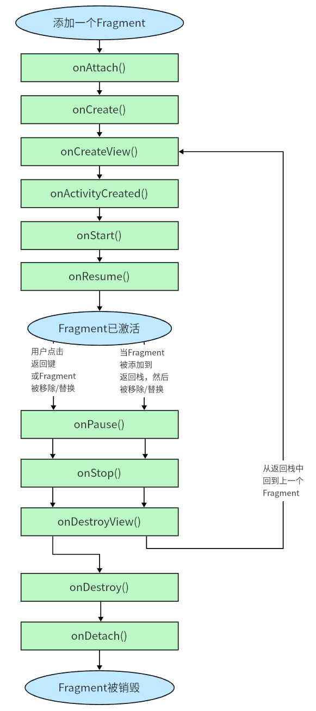

# Activity
**setContentView()**
> Android项目中添加的任何资源都会在R文件中生成一个相应的资源id，
> setCOntentView()中传入的就是布局文件的id

**在AndroidManifest文件中注册**
```xml
<!--注册activity-->
<activity
    android:name=".FirstActivity"
    android:label="This is FirstActivity."
    android:exported="true">
    <!--配置主activity-->
    <intent-filter>
        <action android:name="android.intent.action.MAIN"/>
        <category android:name="android.intent.category.LAUNCHER"/>
    </intent-filter>
    <meta-data
        android:name="android.app.lib_name"
        android:value="" />
</activity>
```

> 应用程序中没有声明任何一个Activity作为主Activity，这个程序仍然可以正常安装，只是无法从启动器中看到或打开这个程序，这种程序一般作为第三方服务供其他应用在内部进行调用的


## 在Activity中使用Menu
```xml
<?xml version="1.0" encoding="utf-8"?>
<menu xmlns:android="http://schemas.android.com/apk/res/android">
    <item
        android:id="@+id/add_item"
        android:title="Add"/>
    <item
        android:id="@+id/remove_item"
        android:title="Remove"/>
</menu>
```
```kotlin
class FirstActivity : AppCompatActivity() {
    ...
    override fun onCreateOptionsMenu(menu: Menu?): Boolean {
        menuInflater.inflate(R.menu.main, menu)
        //返回true表示允许创建的菜单显示，false则无法显示
        return true
    }
}
```

### 销毁一个Activity
Activity类提供了一个**finish()**方法，只需要调用这个方法就可以销毁当前的Activity

## Intent
### 使用显式Intent
**Intent(Context packageContext, Class<?> cls)**
```kotlin
class FirstActivity : AppCompatActivity() {
    private lateinit var binding: ActivityFirstBinding
    override fun onCreate(savedInstanceState: Bundle?) {
        ...
        binding.button1.setOnClickListener {
            val intent = Intent(this, SecondActivity::class.java)
            startActivity(intent)
        }
    }
    ...
}
```
### 使用隐式Intent
指定一系列更为抽象的action和category等信息，然后交由系统去分析这个Intent，并帮我们找出合适的Activity去启动。

通过在`<activity>`标签下配置`<intent-filter>`的内容可以指定当前Activity能够响应的action和category
```xml
<!--AndroidManifest.xml-->
<activity
    android:name=".SecondActivity"
    android:exported="false">
    <intent-filter>
        <action android:name="com.android.firstofall.ACTION_START"/>
        <category android:name="android.intent.category.DEFAULT"/>
    </intent-filter>
    <meta-data
        android:name="android.app.lib_name"
        android:value="" />
</activity>
```
```kotlin
class FirstActivity : AppCompatActivity() {
    private lateinit var binding: ActivityFirstBinding
    override fun onCreate(savedInstanceState: Bundle?) {
        ...
        binding.button1.setOnClickListener {
            //只有action和category中的内容同时匹配，Activity才能响应Intent
            val intent = Intent("com.android.firstofall.ACTION_START")
            intent.addCategory("android.intent.category.DEFAULT")
            startActivity(intent)
        }
    }
    ...
}
```
### 隐式Intent的更多用法
```kotlin
    val intent = Intent(Intent.ACTION_VIEW)
    intent.data = Uri.parse("https://www.baidu.com")
    startActivity(intent)
```
在`<intent-filter>`标签下还能够配置`<data>`标签，例如只需要指定android:scheme为https，就可以让activity也能够响应https协议的Intent

### 向下一个Activity传递数据
```kotlin
class FirstActivity : AppCompatActivity() {
    private lateinit var binding: ActivityFirstBinding
    override fun onCreate(savedInstanceState: Bundle?) {
        super.onCreate(savedInstanceState)
        binding = ActivityFirstBinding.inflate(layoutInflater)
        setContentView(binding.root)
        binding.button1.setOnClickListener {
            val intent = Intent(this, SecondActivity::class.java)
            val data = "Hello"
            intent.putExtra("extra_data", data)
            startActivity(intent)
        }
    }
}
```
```kotlin
class SecondActivity : AppCompatActivity() {
    lateinit var binding: ActivitySecondBinding
    override fun onCreate(savedInstanceState: Bundle?) {
        super.onCreate(savedInstanceState)
        binding = ActivitySecondBinding.inflate(layoutInflater)
        setContentView(binding.root)
        val extraData = intent.getStringExtra("extra_data")
        Log.d("SecondActivity", "extraData is $extraData")
    }
}
```

### 返回数据给上一个Activity
```kotlin
class FirstActivity : AppCompatActivity() {
    private lateinit var binding: ActivityFirstBinding
    override fun onCreate(savedInstanceState: Bundle?) {
        super.onCreate(savedInstanceState)
        binding = ActivityFirstBinding.inflate(layoutInflater)
        setContentView(binding.root)
        binding.button1.setOnClickListener {
            val intent = Intent(this, SecondActivity::class.java)
            startActivityForResult(intent, 1)
        }
    }
    override fun onActivityResult(requestCode: Int, resultCode: Int, data: Intent?) {
        super.onActivityResult(requestCode, resultCode, data)
        when(requestCode){
            1 -> if(resultCode == RESULT_OK){
                val returnData = data?.getStringExtra("data_return")
                Log.d("FirstActivity", "return data is $returnData")
            }
        }
    }
}
```
```kotlin
class SecondActivity : AppCompatActivity() {
    lateinit var binding: ActivitySecondBinding
    override fun onCreate(savedInstanceState: Bundle?) {
        super.onCreate(savedInstanceState)
        binding = ActivitySecondBinding.inflate(layoutInflater)
        setContentView(binding.root)
        binding.button2.setOnClickListener {
            val intent = Intent()
            intent.putExtra("data_return", "return")
            setResult(RESULT_OK, intent)
            finish()
        }
    }
}
```
只有用户按下button返回FirstActivity才会返回数据，按下返回键并不会返回数据，可以重写 **onBackPressed()** 方法来解决这个问题

## Activity生命周期
### Activity状态
**1. 运行状态**
返回栈栈顶
**2. 暂停状态**
不处于返回栈栈顶，但仍然可见
**3. 停止状态**
不处于返回栈栈顶，并且完全不可见
**4. 销毁状态**
从返回栈中移除

### Activity生存期
**1. 完整生存期**
Activity在onCreate()方法和onDestroy()方法之间所经历的就是完整生存期。一般情况下，一个Activity会在onCreate()方法中完成各种初始化操作，而在onDestory()方法中完成释放内存的操作。
**2. 可见生存期**
Activity在onStart()方法和onStop()方法之间所经历的就是可见生存期。在可见生存期内，Activity对用户总是可见的，即便有可能无法和用户进行交互。我们可以通过这两个方法合理的管理那些对用户可见的资源。比如在onStart()方法中对资源进行加载，而在onStop()方法中对资源进行释放，从而保证处于停止状态的Activity不会占用过多内存。
**3. 前台生存期**
Activity在onResume()方法和onPause()方法之间所经历的就是前台生存期。在前台生存期内，Activity总是处于运行状态，此时的Activity是可以与用户进行交互的。



### Activity被回收
Activity中提供了onSaveInstanceState()回调方法，可以保证Activity被回收之前一定会被调用，此方法会携带一个Bundle类型的参数，可以用于保存数据。
在onCreate()方法中也有一个Bundle类型的参数，这个参数一般情况下是null，但如果Activity在被系统回收之前通过onSaveInstanceState()方法保存了数据，这个参数就会带有之前保存的全部数据，以此便可以实现数据的恢复。

## Activity的启动模式
通过在AndroidManifest.xml中通过给`<activity>`标签指定android:launchMode属性来选择启动模式
### standard
**默认模式**
每次启动都会创建一个该Activity的新实例
### singleTop
在启动Activity时如果发现返回栈**栈顶**已经是该Activity，则认为可以直接使用它而**不会再创建**新的Activity实例
### singleTask
在启动Activity时，系统首先在返回栈中检查是否存在该Activity的实例，如果发现存在则直接使用该实例，并把在这个Activity之上的所有其他Activity统统出栈，如果没有则创建一个新的Activity实例
### singleInstance
指定为singleInstance模式的Activity会启用一个新的返回栈来管理这个Activity，在返回时，返回栈为空后会显示另一个返回栈的栈顶

## Activity的最佳实践
### 知晓当前是在哪一个Activity
```kotlin
open class BaseActivity : AppCompatActivity{
    override fun onCreate(savedInstanceState : Bundle?){
        super.onCreate(savedInstanceState)
        Log.d("BaseActivity", javaClass.simpleName)
    }
}

```
### 随时随地退出程序
建立一个单例类作为Activity的集合
```kotlin
object ActivityCollector{
    private val activities = ArrayList<Activity>()
    fun addActivity(activity : Activity){
        activities.add(activity)
    }
    fun removeActivity(activity : Activity){
        activities.remove(activity)
    }
    fun finishAll(){
        for(activity in activities){
            if(!activity.isFinishing){
                activity.finish()
            }
        }
        activities.clear()
    }
}
```
接下来修改BaseActivity中的代码
```kotlin
open class BaseActivity : AppCompatActivity{
    override fun onCreate(savedInstanceState : Bundle?){
        super.onCreate(savedInstanceState)
        Log.d("BaseActivity", javaClass.simpleName)
        ActivityCollector.addActivity(this)
    }

    override fun onDestroy(){
        super.onDestroy()
        ActivityCollector.removeActivity(this)
    }
}
```
至此，以后想在何时退出直接调用 **ActivityCollector.finishAll()** 即可直接退出程序


### 启动Activity的最佳写法
```kotlin
class SecondActivity : BaseActivity{
    companion object{
        fun actionStart(context : Context, data1 : String, data2 : String){
            val intent = Intent(context, SecondActivity::class.java)
            intent.putExtra("param1", data1)
            intent.putExtra("param2", data2)
            context.startActivity(intent)
        }
    }
}
```
以此实现在启动SecondActivity时便可以知道其需要传递哪些数据的效果


# UI
## 常见控件
### TextView

### Button
button中英文字母默认全大写，使用`android:textAllCaps="false"`属性保留原始文字内容

#### 监听器的注册
**1. 函数式API**
```kotlin
class MainActivity : AppCompatActivity() {
    lateinit var binding : ActivityMainBinding
    override fun onCreate(savedInstanceState: Bundle?) {
        super.onCreate(savedInstanceState)
        binding = ActivityMainBinding.inflate(layoutInflater)
        setContentView(binding.root)
        binding.button.setOnClickListener {
            //点击逻辑
        }
    }
}
```
**2. 实现接口**
```kotlin
class MainActivity : AppCompatActivity(), View.OnClickListener {
    lateinit var binding : ActivityMainBinding
    override fun onCreate(savedInstanceState: Bundle?) {
        super.onCreate(savedInstanceState)
        binding = ActivityMainBinding.inflate(layoutInflater)
        setContentView(binding.root)
        binding.button1.setOnClickListener(this)
    }

    override fun onClick(v: View?) {
        when(v){
            binding.button1 -> {
                //点击逻辑
            }
        }
    }
}
```

### EditText
`android:hint="Type something here."`：设置提示性文本
`android:maxLines="2"`：设置文本最大行数，超过将向上滚动

### ImageView

### ProgressBar
Android控件都具有可见属性，在xml中可以通过`android:visibility=""`来指定，在代码中可以使用`setVisibility()`方法来设置

Visibility有三种属性：
**visible**：可见
**invisible**：不可见但仍占用屏幕空间
**gone**：不可见且不占用屏幕空间

可以通过`style="?android:attr/..."`属性来设置进度条的样式

### ALertDialog
弹出对话框，置顶于所有界面元素之上


## 基本布局
### LinearLayout——线性布局
`android:orientation`设置控件排列方向
`android:layout_gravity`设置控件在布局中的对齐方式
`android:layout_weight`用比例的方式指定控件的大小

### RelativeLayout——相对布局


### FrameLayout——帧布局

## 自定义控件
### 引入布局
自定义标题栏
```xml
<?xml version="1.0" encoding="utf-8"?>
<LinearLayout xmlns:android="http://schemas.android.com/apk/res/android"
    android:layout_width="match_parent"
    android:layout_height="wrap_content"
    android:background="@drawable/title_bg">
    <Button
        android:layout_width="wrap_content"
        android:layout_height="wrap_content"
        android:id="@+id/titleBack"
        android:text="back"
        android:layout_margin="5dp"
        android:background="@drawable/back_bg"
        android:textColor="#fff"/>
    <TextView
        android:layout_width="0dp"
        android:layout_height="wrap_content"
        android:id="@+id/titleText"
        android:layout_weight="1"
        android:layout_gravity="center"
        android:gravity="center"
        android:text="Title Text"
        android:textColor="#fff"
        android:textSize="24sp"/>
    <Button
        android:layout_width="wrap_content"
        android:layout_height="wrap_content"
        android:id="@+id/titleEdit"
        android:text="Edit"
        android:layout_margin="5dp"
        android:background="@drawable/edit_bg"
        android:textColor="#fff"/>
</LinearLayout>
```
引入布局
```xml
<?xml version="1.0" encoding="utf-8"?>
<LinearLayout xmlns:android="http://schemas.android.com/apk/res/android"
    android:layout_width="match_parent"
    android:layout_height="match_parent"
    android:orientation="vertical">
    <include layout="@layout/title"/>
</LinearLayout>
```
隐藏系统自带的标题栏
```kotlin
class MainActivity : AppCompatActivity() {
    lateinit var binding : ActivityMainBinding
    override fun onCreate(savedInstanceState: Bundle?) {
        super.onCreate(savedInstanceState)
        binding = ActivityMainBinding.inflate(layoutInflater)
        setContentView(binding.root)
        supportActionBar?.hide()
    }
}
```


### 创建自定义控件
自定义导航栏
```xml
<?xml version="1.0" encoding="utf-8"?>
<LinearLayout xmlns:android="http://schemas.android.com/apk/res/android"
    android:layout_width="match_parent"
    android:layout_height="wrap_content"
    android:background="@drawable/title_bg">
    <Button
        android:layout_width="wrap_content"
        android:layout_height="wrap_content"
        android:id="@+id/titleBack"
        android:text="back"
        android:layout_margin="5dp"
        android:background="@drawable/back_bg"
        android:textColor="#fff"/>
    <TextView
        android:layout_width="0dp"
        android:layout_height="wrap_content"
        android:id="@+id/titleText"
        android:layout_weight="1"
        android:layout_gravity="center"
        android:gravity="center"
        android:text="Title Text"
        android:textColor="#fff"
        android:textSize="24sp"/>
    <Button
        android:layout_width="wrap_content"
        android:layout_height="wrap_content"
        android:id="@+id/titleEdit"
        android:text="Edit"
        android:layout_margin="5dp"
        android:background="@drawable/edit_bg"
        android:textColor="#fff"/>
</LinearLayout>
```
添加自定义控件
```xml
<?xml version="1.0" encoding="utf-8"?>
<LinearLayout xmlns:android="http://schemas.android.com/apk/res/android"
    android:layout_width="match_parent"
    android:layout_height="match_parent"
    android:orientation="vertical">

    <com.android.widgettest.TitleLayout
        android:layout_width="match_parent"
        android:layout_height="wrap_content"/>
</LinearLayout>
```
为自定义控件中的控件注册点击事件
```kotlin
class TitleLayout(context : Context, attrs : AttributeSet) : LinearLayout(context, attrs) {
    var binding : TitleBinding
    init {
        //inflate(layoutInflater, parent, attachToParent)
        binding = TitleBinding.inflate(LayoutInflater.from(context), this, true)
        binding.titleBack.setOnClickListener {
            val activity = context as Activity
            activity.finish()
        }
        binding.titleEdit.setOnClickListener {
            Toast.makeText(context, "Edit", Toast.LENGTH_SHORT).show()
        }
    }
}
```

## ListView
### ListView的简单用法
在布局中引入ListView
```xml
<?xml version="1.0" encoding="utf-8"?>
<LinearLayout xmlns:android="http://schemas.android.com/apk/res/android"
    android:layout_width="match_parent"
    android:layout_height="match_parent">
    <ListView
        android:id="@+id/listView"
        android:layout_width="match_parent"
        android:layout_height="match_parent"/>
</LinearLayout>
```
```kotlin
class ListViewActivity : AppCompatActivity() {
    private val data = listOf("apple", "banana", "orange", "watermelon", "pear", "grape", "pineapple", "strawberry", "cherry", "mango", "apple", "banana", "orange", "watermelon", "pear", "grape", "pineapple", "strawberry", "cherry", "mango")
    lateinit var binding : ActivityListViewBinding
    override fun onCreate(savedInstanceState: Bundle?) {
        super.onCreate(savedInstanceState)
        binding = ActivityListViewBinding.inflate(layoutInflater)
        setContentView(binding.root)
        //在Adapter的构造函数中依次传入 Activity的实例、ListView子项布局的id、数据源
        val adapter = ArrayAdapter<String>(this, android.R.layout.simple_list_item_1, data)
        binding.listView.adapter = adapter
    }
}
```

### 定制ListView的界面
定义实体类
```kotlin
class Fruit(val name : String, val imageId : Int)
```
定制item
```xml
<?xml version="1.0" encoding="utf-8"?>
<LinearLayout xmlns:android="http://schemas.android.com/apk/res/android"
    android:layout_width="match_parent"
    android:layout_height="60dp">
    <ImageView
        android:id="@+id/fruitImage"
        android:layout_gravity="center_vertical"
        android:layout_marginLeft="10dp"
        android:layout_width="40dp"
        android:layout_height="40dp"/>
    <TextView
        android:id="@+id/fruitName"
        android:layout_gravity="center_vertical"
        android:layout_marginLeft="10dp"
        android:layout_width="wrap_content"
        android:layout_height="wrap_content"/>
</LinearLayout>
```
创建自定义适配器
```kotlin
class FruitAdapter(activity : Activity, resourceId : Int, data : List<Fruit>) : ArrayAdapter<Fruit>(activity, resourceId, data) {
    lateinit var binding : FruitItemBinding
    override fun getView(position: Int, convertView: View?, parent: ViewGroup): View {
        binding = FruitItemBinding.inflate(LayoutInflater.from(parent.context), parent, false)
        val fruit = getItem(position)
        if(fruit != null){
            binding.fruitImage.setImageResource(fruit.imageId)
            binding.fruitName.text = fruit.name
        }
        return binding.root
    }
}
```
最后修改Activity中的代码
```kotlin
class ListViewActivity : AppCompatActivity() {
    private val fruitList = ArrayList<Fruit>()
    lateinit var binding : ActivityListViewBinding
    override fun onCreate(savedInstanceState: Bundle?) {
        super.onCreate(savedInstanceState)
        binding = ActivityListViewBinding.inflate(layoutInflater)
        setContentView(binding.root)
        initFruits()
        val adapter = FruitAdapter(this, R.layout.fruit_item, fruitList)
        binding.listView.adapter = adapter
    }
    private fun initFruits(){
        repeat(2){
            fruitList.apply {
                add(Fruit("apple", R.drawable.apple_pic))
                add(Fruit("banana", R.drawable.banana_pic))
                add(Fruit("cherry", R.drawable.cherry_pic))
                add(Fruit("grape", R.drawable.grape_pic))
                add(Fruit("mango", R.drawable.mango_pic))
                add(Fruit("orange", R.drawable.orange_pic))
                add(Fruit("pear", R.drawable.pear_pic))
                add(Fruit("pineapple", R.drawable.pineapple_pic))
                add(Fruit("strawberry", R.drawable.strawberry_pic))
                add(Fruit("watermelon", R.drawable.watermelon_pic))
            }
        }
    }
}
```

> binding = FruitItemBinding.inflate(LayoutInflater.from(parent.context), parent, false)
> **XxxBinding.inflate(layoutInflater, parent, attachToParent)** 中三个参数的含义
> 1. layoutInflater可以直接从contex或parent.context中获取
> 2. parent是给加载好的布局指定父布局
> 3. attachToParent为true时表示将布局添加入parent中并且不能再向parent中添加view，为false时表示不将第一个参数的view添加到parent中，parent会协助第一个参数view的根节点生成布局参数，这个时候我们要手动地把view添加进来

### 提升ListView的运行效率
getView()方法中有一个convertView参数，这个参数就是用于将之前加载好的布局进行缓存，因此可以做出如下优化
```kotlin
class FruitAdapter(activity : Activity, resourceId : Int, data : List<Fruit>) : ArrayAdapter<Fruit>(activity, resourceId, data) {
    lateinit var binding : FruitItemBinding
    override fun getView(position: Int, convertView: View?, parent: ViewGroup): View {
        val view : View
        //如果convertView为null，则使用LayoutInflater加载布局；如果不为null，则直接对convertView进行重用
        if(convertView == null){
            binding = FruitItemBinding.inflate(LayoutInflater.from(parent.context), parent, false)
            view = binding.root
        }else{
            view = convertView
        }
        val fruit = getItem(position)
        if(fruit != null){
            binding.fruitImage.setImageResource(fruit.imageId)
            binding.fruitName.text = fruit.name
        }
        return view
    }
}
```

虽然现在已经**不会再重复加载布局**，但是每次getView()方法中仍然会**获取一次控件的实例**，可以借助ViewHolder来对这部分进行性能优化
```kotlin
class FruitAdapter(activity : Activity, resourceId : Int, data : List<Fruit>) : ArrayAdapter<Fruit>(activity, resourceId, data) {
    lateinit var binding : FruitItemBinding
    override fun getView(position: Int, convertView: View?, parent: ViewGroup): View {
        val view : View
        val viewHolder : ViewHolder
        if(convertView == null){
            binding = FruitItemBinding.inflate(LayoutInflater.from(parent.context), parent, false)
            view = binding.root
            val fruitImage : ImageView = binding.fruitImage
            val fruitName : TextView = binding.fruitName
            viewHolder = ViewHolder(fruitImage, fruitName)
            view.tag = viewHolder
        }else{
            view = convertView
            viewHolder = view.tag as ViewHolder
        }
        val fruit = getItem(position)
        if(fruit != null){
            viewHolder.fruitImage.setImageResource(fruit.imageId)
            viewHolder.fruitName.text = fruit.name
        }
        return view
    }
    inner class ViewHolder(val fruitImage : ImageView, val fruitName : TextView)
}
```
View中的setTag（Onbect）表示给View添加一个格外的数据，以后可以用getTag()将这个数据取出来。
此时当convertView为null时，会创建一个ViewHolder对象，并将控件的实例存放在其中，然后用setTag()方法将ViewHolder对象存放在View中。当convertView不为null时，则调用View的getTag()方法把ViewHolder对象取出，这样就免去了findViewById()操作，不用重复获取控件实例。

### ListView的点击事件
```kotlin
class ListViewActivity : AppCompatActivity() {
    private val fruitList = ArrayList<Fruit>()
    lateinit var binding : ActivityListViewBinding
    override fun onCreate(savedInstanceState: Bundle?) {
        super.onCreate(savedInstanceState)
        binding = ActivityListViewBinding.inflate(layoutInflater)
        setContentView(binding.root)
        initFruits()
        val adapter = FruitAdapter(this, R.layout.fruit_item, fruitList)
        binding.listView.adapter = adapter
        //binding.listView.setOnItemClickListener { parent, view, position, id ->
        //kotlin中允许我们将没用到的参数用下划线来替代
        binding.listView.setOnItemClickListener { _, _, position, _ ->
            val fruit = fruitList[position]
            Toast.makeText(this, fruit.name, Toast.LENGTH_SHORT).show()
        }
    }
    ...
}
```

## RecyclerView
**运行效率**
**更好的扩展性**
### RecyclerView基本用法
RecyclerView属于新增控件，使用前需要在在build.gradle中添加依赖
```gradle
dependencies {
    implementation 'androidx.recyclerview:recyclerview:1.2.1'
    ...
}
```
在布局中引入RecyclerView
```xml
<?xml version="1.0" encoding="utf-8"?>
<androidx.constraintlayout.widget.ConstraintLayout xmlns:android="http://schemas.android.com/apk/res/android"
    android:layout_width="match_parent"
    android:layout_height="match_parent">
    <androidx.recyclerview.widget.RecyclerView
        android:id="@+id/recyclerView"
        android:layout_width="match_parent"
        android:layout_height="match_parent"/>
</androidx.constraintlayout.widget.ConstraintLayout>
```
为RecyclerView准备一个适配器
```kotlin
class FruitRecyclerViewAdapter(val fruitList : List<Fruit>) : RecyclerView.Adapter<FruitRecyclerViewAdapter.ViewHolder>() {
    inner class ViewHolder(binding: FruitItemBinding) : RecyclerView.ViewHolder(binding.root){
        val fruitImage : ImageView = binding.fruitImage
        val fruitName : TextView = binding.fruitName
    }
    override fun onCreateViewHolder(parent: ViewGroup, viewType: Int): ViewHolder {
        val binding = FruitItemBinding.inflate(LayoutInflater.from(parent.context), parent, false)
        return ViewHolder(binding)
    }
    override fun onBindViewHolder(holder: ViewHolder, position: Int) {
        val fruit = fruitList[position]
        holder.fruitImage.setImageResource(fruit.imageId)
        holder.fruitName.text = fruit.name
    }
    override fun getItemCount(): Int = fruitList.size
}
```
1. 让ViewHolder构造函数接收FruitItemBinding这个参数。但是注意，**ViewHolder的父类RecyclerView.ViewHolder它只会接收View类型的参数**，因此我们需要调用binding.root获得fruit_item.xml中根元素的实例传给RecyclerView.ViewHolder。我们在onCreateViewHolder()函数中调用FruitItemBinding的inflate()函数去加载fruit_item.xml布局文件，然后创建一个ViewHolder实例，并把加载出来的布局传入构造函数中，最后将ViewHolder实例返回。这样，我们就**不需要再使用findViewById()函数**来查找控件实例了，而是调用binding.fruitImage和binding.fruitName就可以直接引用到相应控件的实例。
2. onBindViewHolder()方法用于对RecyclerView子项数据进行赋值，会在每个子项被滚动到屏幕内的时候执行。

```kotlin
class RecyclerViewActivity : AppCompatActivity() {
    lateinit var binding : ActivityRecyclerViewBinding
    private val fruitList = ArrayList<Fruit>()
    override fun onCreate(savedInstanceState: Bundle?) {
        super.onCreate(savedInstanceState)
        binding = ActivityRecyclerViewBinding.inflate(layoutInflater)
        setContentView(binding.root)
        initFruits()
        val layoutManager = LinearLayoutManager(this)
        binding.recyclerView.layoutManager = layoutManager
        val adapter = FruitRecyclerViewAdapter(fruitList)
        binding.recyclerView.adapter = adapter
    }
    private fun initFruits(){
        ...
    }
}
```
**LayoutManager**用于指定RecyclerView的布局方式

### 实现横向滚动和瀑布流布局
#### 横向滚动
修改fruit_item布局为垂直线性布局，宽度指定固定布局
```xml
<?xml version="1.0" encoding="utf-8"?>
<LinearLayout xmlns:android="http://schemas.android.com/apk/res/android"
    android:layout_width="80dp"
    android:orientation="vertical"
    android:layout_height="wrap_content">
    <ImageView
        android:id="@+id/fruitImage"
        android:layout_gravity="center_horizontal"
        android:layout_marginTop="10dp"
        android:layout_width="40dp"
        android:layout_height="40dp"/>
    <TextView
        android:id="@+id/fruitName"
        android:layout_gravity="center_horizontal"
        android:layout_marginTop="10dp"
        android:layout_width="wrap_content"
        android:layout_height="wrap_content"/>
</LinearLayout>
```
**LayoutManager**指定RecyclerView的布局方式为水平方向布局
```kotlin
class RecyclerViewActivity : AppCompatActivity() {
    lateinit var binding : ActivityRecyclerViewBinding
    private val fruitList = ArrayList<Fruit>()
    override fun onCreate(savedInstanceState: Bundle?) {
        ...
        val layoutManager = LinearLayoutManager(this)
        layoutManager.orientation = LinearLayoutManager.HORIZONTAL
        binding.recyclerView.layoutManager = layoutManager
        val adapter = FruitRecyclerViewAdapter(fruitList)
        binding.recyclerView.adapter = adapter
    }
    ...
}
```
**网格布局：GridLayoutManager**
**瀑布流布局：StaggeredGridLayoutManager**

### RecyclerView的点击事件
RecyclerView需要我们自己给子项具体的View去注册点击事件
```kotlin
class FruitRecyclerViewAdapter(val fruitList : List<Fruit>) : RecyclerView.Adapter<FruitRecyclerViewAdapter.ViewHolder>() {
    inner class ViewHolder(binding: FruitScrollItemBinding) : RecyclerView.ViewHolder(binding.root){
        val fruitImage : ImageView = binding.fruitImage
        val fruitName : TextView = binding.fruitName
    }
    override fun onCreateViewHolder(parent: ViewGroup, viewType: Int): ViewHolder {
        val binding = FruitScrollItemBinding.inflate(LayoutInflater.from(parent.context), parent, false)
        val viewHolder = ViewHolder(binding)
        viewHolder.fruitImage.setOnClickListener {
            val position = viewHolder.bindingAdapterPosition
            val fruit = fruitList[position]
            Toast.makeText(parent.context, "image ${fruit.name}", Toast.LENGTH_SHORT).show()
        }
        viewHolder.fruitName.setOnClickListener {
            val position = viewHolder.bindingAdapterPosition
            val fruit = fruitList[position]
            Toast.makeText(parent.context, "text ${fruit.name}", Toast.LENGTH_SHORT).show()
        }
        return viewHolder
    }
    override fun onBindViewHolder(holder: ViewHolder, position: Int) {
        val fruit = fruitList[position]
        holder.fruitImage.setImageResource(fruit.imageId)
        holder.fruitName.text = fruit.name
    }
    override fun getItemCount(): Int = fruitList.size
}
```
`val position = viewHolder.bindingAdapterPosition`
* getBindingAdapterPostion：返回该ViewHolder相对于它绑定的Adapter中的位置，即**相对位置**。
* getAbsoluteAdapterPosition：返回该ViewHolder相对于RecyclerView的位置，即**绝对位置**。

## 编写界面的最佳实践
### 制作9-Patch图片
9-Patch图片能够指定哪些区域可以被拉伸、哪些区域不可以被拉伸

### 编写精美的聊天界面
Msg实体类
```kotlin
class Msg(val content : String, val type : Int) {
    companion object{
        const val TYPE_RECEIVED = 0
        const val TYPE_SENT = 1
    }
}
```
> 只有在单例类、companion object或顶层方法中才可以使用const关键字

RecyclerView的子项布局有两种，分别创建msg_left_item.xml和msg_right_item.xml

创建RecyclerView的适配器
```kotlin
class MsgAdapter(val msgList : List<Msg>) : RecyclerView.Adapter<RecyclerView.ViewHolder>() {
    inner class LeftViewHolder(binding : MsgLeftItemBinding) : RecyclerView.ViewHolder(binding.root){
        val leftMsg : TextView = binding.leftMsg
    }
    inner class RightViewHolder(binding : MsgRightLayoutBinding) : RecyclerView.ViewHolder(binding.root){
        val rightMsg : TextView = binding.rightMsg
    }
    override fun getItemViewType(position: Int): Int {
        val msg = msgList[position]
        return msg.type
    }
    override fun onCreateViewHolder(parent: ViewGroup, viewType: Int): RecyclerView.ViewHolder = if(viewType == Msg.TYPE_RECEIVED){
        val binding = MsgLeftItemBinding.inflate(LayoutInflater.from(parent.context), parent, false)
        LeftViewHolder(binding)
    }else{
        val binding = MsgRightLayoutBinding.inflate(LayoutInflater.from(parent.context), parent, false)
        RightViewHolder(binding)
    }
    override fun onBindViewHolder(holder: RecyclerView.ViewHolder, position: Int) {
        val msg = msgList[position]
        when(holder){
            is LeftViewHolder -> holder.leftMsg.text = msg.content
            is RightViewHolder -> holder.rightMsg.text = msg.content
            else -> throw java.lang.IllegalArgumentException()
        }
    }
    override fun getItemCount(): Int = msgList.size
}
```
最后准备一些数据，并给发送按钮添加点击事件
```kotlin
class UIBestActivity : AppCompatActivity(), View.OnClickListener {
    private val msgList = ArrayList<Msg>()
    private var adapter : MsgAdapter? = null
    lateinit var binding : ActivityUibestBinding
    override fun onCreate(savedInstanceState: Bundle?) {
        super.onCreate(savedInstanceState)
        binding = ActivityUibestBinding.inflate(layoutInflater)
        setContentView(binding.root)
        initMsg()
        val layoutManager = LinearLayoutManager(this)
        binding.recyclerView.layoutManager = layoutManager
        adapter = MsgAdapter(msgList)
        binding.recyclerView.adapter = adapter
        binding.sendButton.setOnClickListener(this)
    }
    override fun onClick(v: View?) {
        when(v){
            binding.sendButton -> {
                val content = binding.inputText.text.toString()
                if(content.isNotEmpty()){
                    val msg = Msg(content, Msg.TYPE_SENT)
                    msgList.add(msg)
                    //通知列表有新的数据插入
                    adapter?.notifyItemInserted(msgList.size - 1)
                    //将显示的数据定位到最后一行
                    binding.recyclerView.scrollToPosition(msgList.size - 1)
                    binding.inputText.setText("")
                }
            }
        }
    }
    private fun initMsg(){
        val msg1 = Msg("How are you?", Msg.TYPE_RECEIVED)
        msgList.add(msg1)
        val msg2 = Msg("Fine, thank you, and you?", Msg.TYPE_SENT)
        msgList.add(msg2)
        val msg3 = Msg("I'm fine, too!", Msg.TYPE_RECEIVED)
        msgList.add(msg3)
    }
}
```


# Fragment
## Fragment的使用方式
### Fragment的简单用法
首先编写fragment的布局
left_fragment.xml
right_fragment.xml
```xml
<?xml version="1.0" encoding="utf-8"?>
<LinearLayout xmlns:android="http://schemas.android.com/apk/res/android"
    android:orientation="vertical"
    android:layout_width="match_parent"
    android:layout_height="match_parent">
    <Button
        android:id="@+id/button"
        android:layout_gravity="center_horizontal"
        android:text="button"
        android:layout_width="wrap_content"
        android:layout_height="wrap_content"/>
</LinearLayout>
```
编写Fragment中的代码
LeftFragment.kt
RightFragment.kt
```kotlin
class LeftFragment : Fragment() {
    private var _binding : LeftFragmentBinding? = null
    val binding get() = _binding!!
    override fun onCreateView(inflater: LayoutInflater, container: ViewGroup?, savedInstanceState: Bundle?): View? {
        _binding = LeftFragmentBinding.inflate(inflater, container, false)
        return binding.root
    }
    override fun onDestroyView() {
        super.onDestroyView()
        _binding = null
    }
}
```
在activity布局中添加fragment
```xml
<?xml version="1.0" encoding="utf-8"?>
<LinearLayout xmlns:android="http://schemas.android.com/apk/res/android"
    android:layout_width="match_parent"
    android:layout_height="match_parent">
    <fragment
        android:id="@+id/leftFrag"
        android:name="com.android.fragment.LeftFragment"
        android:layout_width="0dp"
        android:layout_weight="1"
        android:layout_height="match_parent"/>
    <fragment
        android:id="@+id/rightFrag"
        android:name="com.android.fragment.RightFragment"
        android:layout_width="0dp"
        android:layout_weight="1"
        android:layout_height="match_parent"/>
</LinearLayout>
```
> 注意此处需要通过android:name属性显式声明要添加的Fragment类名

### 动态添加Fragment
activity_main.xml
```xml
<?xml version="1.0" encoding="utf-8"?>
<LinearLayout xmlns:android="http://schemas.android.com/apk/res/android"
    android:layout_width="match_parent"
    android:layout_height="match_parent">
    <fragment
        android:id="@+id/leftFrag"
        android:name="com.android.fragment.LeftFragment"
        android:layout_width="0dp"
        android:layout_weight="1"
        android:layout_height="match_parent"/>
    <FrameLayout
        android:id="@+id/rightLayout"
        android:layout_width="0dp"
        android:layout_height="match_parent"
        android:layout_weight="1"/>
</LinearLayout>
```
MainActivity.kt
```kotlin
class MainActivity : AppCompatActivity() {
    lateinit var binding : ActivityMainBinding
    private lateinit var leftFragmentBinding : LeftFragmentBinding
    override fun onCreate(savedInstanceState: Bundle?) {
        super.onCreate(savedInstanceState)
        binding = ActivityMainBinding.inflate(layoutInflater)
        setContentView(binding.root)
        replaceFragment(AnotherRightFragment())
        val leftFrag = supportFragmentManager.findFragmentById(R.id.leftFrag) as LeftFragment
        leftFrag.binding.button.setOnClickListener {
            Log.d("TestBtn", "clicked")
        }
        replaceFragment(RightFragment())
    }
    private fun replaceFragment(fragment: Fragment){
        val fragmentManager = supportFragmentManager
        val transaction = fragmentManager.beginTransaction()
        transaction.replace(binding.rightLayout.id, fragment)
        transaction.commit()
    }
}
```
`leftFragmentBinding = LeftFragmentBinding.bind(binding.root)`让fragment_one.xml布局和activity_main.xml布局能够关联起来

### 在fragment中实现返回栈
```kotlin
class MainActivity : AppCompatActivity() {
    ...
    private fun replaceFragment(fragment: Fragment){
        val fragmentManager = supportFragmentManager
        val transaction = fragmentManager.beginTransaction()
        transaction.replace(binding.rightLayout.id, fragment)
        //接收一个名字作为返回栈的状态，一般传入null即可
        transaction.addToBackStack(null)
        transaction.commit()
    }
}
```

### Fragment和Activity之间的交互
FragmentManager提供了一个类似于findViewBuId()的方法，专门用于从布局文件中获取Fragment
```kotlin
    val fragment = supportFragmentManager.findFragmentById(R.id.leftFrag) as LeftFragment
```
获取fragment后便可获取其中的binding对象
```kotlin
class MainActivity : AppCompatActivity() {
    lateinit var binding : ActivityMainBinding
    private lateinit var leftFragmentBinding : LeftFragmentBinding
    override fun onCreate(savedInstanceState: Bundle?) {
        super.onCreate(savedInstanceState)
        binding = ActivityMainBinding.inflate(layoutInflater)
        setContentView(binding.root)
        val leftFrag = supportFragmentManager.findFragmentById(R.id.leftFrag) as LeftFragment
        leftFrag.binding.button.setOnClickListener {
            Log.d("TestBtn", "clicked")
            replaceFragment(RightFragment())
        }
    }
}
```

在每个Fragment中都可以通过调用getActivity()方法来得到和当前fragment相关联的Activity实例
```kotlin
    if(activity != null){
        val mainActivity = activity as MainActivity
    }
```
当Fragment中需要使用Context对象时，也可以使用getActivity()方法，因为获取到的Activity本身就是一个Context对象

## Fragment生命周期
### Fragment的状态和回调
**1. 运行状态**
当一个Fragment所关联的Activity正处于运行状态时，该Fragment也处于运行状态
**2. 暂停状态**
当一个Activity进入暂停状态时，与它相关联的Fragment就会进入暂停状态
**3. 停止状态**
当一个Activity进入停止状态时，与它相关联的Fragment就会进入停止状态。或者通过调用FragmentTransaction的remove()、replace()方法将Fragment从Activity中移除，但在事物提交之前**调用了**addToBackStack()方法，这时的Fragment也会进入停止状态。停止状态的Fragment对用户是完全不可见的。
**4. 销毁状态**
当一个Activity被销毁时，与它相关联的Fragment就会进入销毁状态。或者通过调用FragmentTransaction的remove()、replace()方法将Fragment从Activity中移除，但在事物提交之前**没有调用**addToBackStack()方法，这时的Fragment也会进入停止状态。

**onAttach()**：当Fragment和Activity建立关联时调用
**onCreateView()**：为Fragment创建视图时调用
**onActivityCreated()**：确保与Fragment相关联的Activity已经创建完毕时调用
**onDestroyView()**：与Fragment关联的视图被移除时调用
**onDetach()**：Fragment与Activity解除关联时调用




Fragment中可以通过
```kotlin
    override fun onSaveInstanceState(outState: Bundle) {
        super.onSaveInstanceState(outState)
    }
```
来保存数据，保存下来的数据在onCreate()、onCreateView()、onActivityCreated()这三个方法中可以重新得到

## 动态加载布局的技巧
### 使用限定符
在res目录下新建layout-large文件夹，在这个文件夹下新建布局也叫做activity_main.xml。这样那些屏幕被认为是large的设备就会自动加载layout-large文件夹下的布局，小屏幕的设备则还是会加载layout文件夹下的布局。

### 使用最小宽度限定符
在res目录下新建layout-sw600dp文件夹，然后在文件夹下新建activity_main.xml布局，这就意味着，当程序运行在屏幕宽度大于等于600dp的设备上时，会加载layout-sw600dp文件夹下的布局，当程序运行在屏幕宽度小于600dp的设备上时，则仍然加载默认的layout目录下的布局


## Fragment的最佳实践：一个简易版的新闻应用
news_content_frag.xml
```xml
<?xml version="1.0" encoding="utf-8"?>
<RelativeLayout xmlns:android="http://schemas.android.com/apk/res/android"
    android:layout_width="match_parent"
    android:layout_height="match_parent">
    <!--将新闻内容布局设置为不可见，因为在双页模式下，在没选中列表中任何一条新闻时，是不应该看到新闻内容布局的-->
    <LinearLayout
        android:id="@+id/contentLayout"
        android:orientation="vertical"
        android:visibility="invisible"
        android:layout_width="match_parent"
        android:layout_height="match_parent">
        <TextView
            android:id="@+id/newsTitle"
            android:gravity="center"
            android:padding="10dp"
            android:textSize="20sp"
            android:layout_width="match_parent"
            android:layout_height="wrap_content"/>
        <View
            android:layout_width="match_parent"
            android:layout_height="1dp"
            android:background="#000"/>
        <TextView
            android:id="@+id/newsContent"
            android:padding="15dp"
            android:textSize="18sp"
            android:layout_width="match_parent"
            android:layout_height="0dp"
            android:layout_weight="1"/>
    </LinearLayout>
    <View
        android:layout_alignParentLeft="true"
        android:background="#000"
        android:layout_width="1dp"
        android:layout_height="match_parent"/>
</RelativeLayout>
```
NewsContentFragment.kt
```kotlin
class NewsContentFragment : Fragment() {
    private var _binding : NewsContentFragBinding? = null
    val binding get() = _binding!!
    override fun onCreateView(inflater: LayoutInflater, container: ViewGroup?, savedInstanceState: Bundle?): View? {
        _binding = NewsContentFragBinding.inflate(inflater, container, false)
        return binding.root
    }
    override fun onDestroyView() {
        super.onDestroyView()
        _binding = null
    }
    //提供显示新闻的方法
    fun refresh(title : String, content : String){
        binding.contentLayout.visibility = View.VISIBLE
        binding.newsTitle.text = title
        binding.newsContent.text = content
    }
}
```
layout/activity_main.xml
```xml
<?xml version="1.0" encoding="utf-8"?>
<LinearLayout xmlns:android="http://schemas.android.com/apk/res/android"
    android:orientation="horizontal"
    android:layout_width="match_parent"
    android:layout_height="match_parent">
    <FrameLayout xmlns:android="http://schemas.android.com/apk/res/android"
        android:id="@+id/newsTitleLayout"
        android:layout_width="match_parent"
        android:layout_height="match_parent">
        <fragment
            android:id="@+id/newsTitleFrag"
            android:name="com.android.newsapplication.NewsTitleFragment"
            android:layout_width="match_parent"
            android:layout_height="match_parent"/>

    </FrameLayout>
</LinearLayout>
```
在单页模式中还需要一个显示新闻内容的activity
activity_news_content.xml
```xml
<?xml version="1.0" encoding="utf-8"?>
<LinearLayout xmlns:android="http://schemas.android.com/apk/res/android"
    android:orientation="vertical"
    android:layout_width="match_parent"
    android:layout_height="match_parent">
    <fragment
        android:id="@+id/newsContentFrag"
        android:name="com.android.newsapplication.NewsContentFragment"
        android:layout_width="match_parent"
        android:layout_height="match_parent"/>
</LinearLayout>
```
NewsContentActivity.kt
```kotlin
class NewsContentActivity : AppCompatActivity() {
    //activity跳转的最佳实践
    companion object{
        fun actionStart(context : Context, title : String, content : String){
            val intent = Intent(context, NewsContentActivity::class.java).apply {
                putExtra("news_title", title)
                putExtra("news_content", content)
            }
            context.startActivity(intent)
        }
    }
    lateinit var binding : ActivityNewsContentBinding
    override fun onCreate(savedInstanceState: Bundle?) {
        super.onCreate(savedInstanceState)
        binding = ActivityNewsContentBinding.inflate(layoutInflater)
        setContentView(binding.root)
        val title = intent.getStringExtra("news_title")
        val content = intent.getStringExtra("news_content")
        if(title != null && content != null){
            val fragment = supportFragmentManager.findFragmentById(R.id.newsContentFrag) as NewsContentFragment
            fragment.refresh(title, content)
        }
    }
}
```
news_title_frag.xml
```xml
<?xml version="1.0" encoding="utf-8"?>
<LinearLayout xmlns:android="http://schemas.android.com/apk/res/android"
    android:orientation="vertical"
    android:layout_width="match_parent"
    android:layout_height="match_parent">
    <androidx.recyclerview.widget.RecyclerView
        android:id="@+id/newsTitleRecyclerView"
        android:layout_width="match_parent"
        android:layout_height="match_parent"/>
</LinearLayout>
```
news_item.xml
```xml
<?xml version="1.0" encoding="utf-8"?>
<TextView xmlns:android="http://schemas.android.com/apk/res/android"
    android:id="@+id/newsTitle"
    android:maxLines="1"
    android:ellipsize="end"
    android:textSize="18sp"
    android:paddingLeft="10dp"
    android:paddingRight="10dp"
    android:paddingTop="15dp"
    android:paddingBottom="15dp"
    android:layout_width="match_parent"
    android:layout_height="wrap_content"/>
```
NewsTitleFragment.kt
```kotlin
class NewsTitleFragment : Fragment() {
    private var _binding : NewsTitleFragBinding? = null
    val binding get() = _binding!!
    private var isTwoPane = false
    override fun onCreateView(inflater: LayoutInflater, container: ViewGroup?, savedInstanceState: Bundle?): View? {
        _binding = NewsTitleFragBinding.inflate(inflater, container, false)
        return binding.root
    }
    override fun onActivityCreated(savedInstanceState: Bundle?) {
        super.onActivityCreated(savedInstanceState)
        isTwoPane = activity?.findViewById<View>(R.id.newsContentLayout) != null
        val layoutManager = LinearLayoutManager(activity)
        binding.newsTitleRecyclerView.layoutManager = layoutManager
        val adapter = NewsAdapter(getNews())
        binding.newsTitleRecyclerView.adapter = adapter
    }
    //数据准备
    private fun getNews() : List<News>{
        val newsList = ArrayList<News>()
        for (i in 1..50){
            val news = News("This is news title $i.", getRandomLengthString("This is news content $i."))
            newsList.add(news)
        }
        return newsList
    }
    private fun getRandomLengthString(str : String) : String{
        val n = (1..20).random()
        val builder = StringBuilder()
        repeat(n){
            builder.append(str)
        }
        return builder.toString()
    }
    override fun onDestroyView() {
        super.onDestroyView()
        _binding = null
    }
    //NewsAdapter
    //写成内部类的好处是此处可以直接访问NewsTitleFragment的变量，如isTwoPane
    inner class NewsAdapter(val newsList : List<News>) : RecyclerView.Adapter<NewsAdapter.ViewHolder>(){
        inner class ViewHolder(binding: NewsItemBinding) : RecyclerView.ViewHolder(binding.root){
            val newsTitle : TextView = binding.newsTitle
        }
        override fun onCreateViewHolder(parent: ViewGroup, viewType: Int): ViewHolder {
            val newsItemBinding = NewsItemBinding.inflate(LayoutInflater.from(parent.context), parent, false)
            val holder = ViewHolder(newsItemBinding)
            holder.itemView.setOnClickListener {
                val news = newsList[holder.bindingAdapterPosition]
                if(isTwoPane){
                    val fragment = activity?.supportFragmentManager?.findFragmentById(R.id.newsContentFrag) as NewsContentFragment
                    fragment.refresh(news.title, news.content)
                }else{
                    NewsContentActivity.actionStart(parent.context, news.title, news.content)
                }
            }
            return holder
        }
        override fun onBindViewHolder(holder: ViewHolder, position: Int) {
            val news = newsList[position]
            holder.newsTitle.text = news.title
        }
        override fun getItemCount(): Int = newsList.size
    }
}
```
layout-sw600dp/activity_main.xml
```xml
<?xml version="1.0" encoding="utf-8"?>
<LinearLayout xmlns:android="http://schemas.android.com/apk/res/android"
    android:orientation="horizontal"
    android:layout_width="match_parent"
    android:layout_height="match_parent">
    <fragment
        android:id="@+id/newsTitleFrag"
        android:name="com.android.newsapplication.NewsTitleFragment"
        android:layout_width="0dp"
        android:layout_height="match_parent"
        android:layout_weight="1"/>
    <FrameLayout
        android:id="@+id/newsContentLayout"
        android:layout_width="0dp"
        android:layout_height="match_parent"
        android:layout_weight="3">
        <fragment
            android:id="@+id/newsContentFrag"
            android:name="com.android.newsapplication.NewsContentFragment"
            android:layout_width="match_parent"
            android:layout_height="match_parent"/>
    </FrameLayout>
</LinearLayout>
```

# 广播
## 广播机制简介
**Android中广播的分类**
* 标准广播
    异步执行的广播
* 有序广播
    同步执行的广播

## 接收系统广播
**注册BroadcastReceiver的方式**
* 动态注册
* 静态注册
### 动态注册
```kotlin
class MainActivity : AppCompatActivity() {
    lateinit var binding : ActivityMainBinding
    lateinit var timeChangeReceiver : TimeChangeReceiver
    override fun onCreate(savedInstanceState: Bundle?) {
        super.onCreate(savedInstanceState)
        binding = ActivityMainBinding.inflate(layoutInflater)
        setContentView(binding.root)
        val intentFilter = IntentFilter()
        //系统每隔1分钟就会发出一条android.intent.action.TIME_TICK广播
        intentFilter.addAction("android.intent.action.TIME_TICK")
        timeChangeReceiver = TimeChangeReceiver()
        registerReceiver(timeChangeReceiver, intentFilter)
    }
    override fun onDestroy() {
        super.onDestroy()
        unregisterReceiver(timeChangeReceiver)
    }
    inner class TimeChangeReceiver : BroadcastReceiver(){
        override fun onReceive(context: Context?, intent: Intent?) {
            Toast.makeText(context, "Time is changed", Toast.LENGTH_SHORT).show()
        }
    }
}
```
系统广播列表可以在 **\<Android SDK>/platforms/<android api版本>/data/broadcast_actions.txt** 查看
**动态注册的BroadcastReceiver一定要取消注册**

### 静态注册
动态注册的BroadcastReceiver可以自由控制注册与注销，但其必须在程序启动后才能接收广播。

实现开机启动
```kotlin
class BootCompleteReceiver : BroadcastReceiver() {
    override fun onReceive(context: Context, intent: Intent) {
        // This method is called when the BroadcastReceiver is receiving an Intent broadcast.
        Toast.makeText(context, "Boot Complete", Toast.LENGTH_SHORT).show()
    }
}
```
在AndroidManifest.xml中注册，并添加权限
```xml
<?xml version="1.0" encoding="utf-8"?>
<manifest xmlns:android="http://schemas.android.com/apk/res/android"
    xmlns:tools="http://schemas.android.com/tools">
    <!--权限-->
    <uses-permission android:name="android.permission.RECEIVE_BOOT_COMPLETED"/>
    <application
        android:allowBackup="true"
        android:dataExtractionRules="@xml/data_extraction_rules"
        android:fullBackupContent="@xml/backup_rules"
        android:icon="@mipmap/ic_launcher"
        android:label="@string/app_name"
        android:roundIcon="@mipmap/ic_launcher_round"
        android:supportsRtl="true"
        android:theme="@style/Theme.BroadcastReceiverApplication"
        tools:targetApi="31">
        <!--注册-->
        <receiver
            android:name=".BootCompleteReceiver"
            android:enabled="true"
            android:exported="true"></receiver>
        ...
    </application>
</manifest>
```
BroadcastReceiver中是不允许开启线程的，当onRecrive()方法运行了较长时间而没有结束时，程序就会出现错误。

## 发送自定义广播
### 发送标准广播
```kotlin
class MyBroadcastReceiver : BroadcastReceiver() {
    override fun onReceive(context: Context, intent: Intent) {
        // This method is called when the BroadcastReceiver is receiving an Intent broadcast.
        Toast.makeText(context, "Receive in myBroadcastReceiver", Toast.LENGTH_SHORT).show()
    }
}
```
```xml
<?xml version="1.0" encoding="utf-8"?>
<manifest xmlns:android="http://schemas.android.com/apk/res/android"
    xmlns:tools="http://schemas.android.com/tools">
    <application
        android:allowBackup="true"
        android:dataExtractionRules="@xml/data_extraction_rules"
        android:fullBackupContent="@xml/backup_rules"
        android:icon="@mipmap/ic_launcher"
        android:label="@string/app_name"
        android:roundIcon="@mipmap/ic_launcher_round"
        android:supportsRtl="true"
        android:theme="@style/Theme.BroadcastReceiverApplication"
        tools:targetApi="31">
        <receiver
            android:name=".MyBroadcastReceiver"
            android:enabled="true"
            android:exported="true">
            <intent-filter android:priority="100">
                <action android:name="com.android.broadcastreceiverapplication.MY_BROADCAST" />
            </intent-filter>
        </receiver>
        ...
    </application>

</manifest>
```
```kotlin
class MainActivity : AppCompatActivity() {
    lateinit var binding : ActivityMainBinding
    override fun onCreate(savedInstanceState: Bundle?) {
        super.onCreate(savedInstanceState)
        binding = ActivityMainBinding.inflate(layoutInflater)
        setContentView(binding.root)
        binding.button.setOnClickListener {
            val intent = Intent("com.android.broadcastreceiverapplication.MY_BROADCAST")
            intent.setPackage(packageName)
            sendBroadcast(intent)
        }
    }
}
```
在Android8.0系统之后，静态注册的BroadcastReceiver是无法接收隐式广播的，而默认情况下我们自定义的广播恰恰都是隐式广播，因此一定要调用setPackage(packageName)方法指定这条广播是发给哪个应用程序的，从而让它变成一条显式广播。
### 发送有序广播
自定义另一个BroadcastReceiver
```kotlin
class AnotherBroadcastReceiver : BroadcastReceiver() {
    override fun onReceive(context: Context, intent: Intent) {
        // This method is called when the BroadcastReceiver is receiving an Intent broadcast.
        Toast.makeText(context, "Receive in anotherBroadcastReceiver", Toast.LENGTH_SHORT).show()
    }
}
```
```kotlin
class MainActivity : AppCompatActivity() {
    lateinit var binding : ActivityMainBinding
    override fun onCreate(savedInstanceState: Bundle?) {
        super.onCreate(savedInstanceState)
        binding = ActivityMainBinding.inflate(layoutInflater)
        setContentView(binding.root)
        binding.button.setOnClickListener {
            val intent = Intent("com.android.broadcastreceiverapplication.MY_BROADCAST")
            intent.setPackage(packageName)
            sendOrderedBroadcast(intent, null)
        }
    }
}
```
```xml
    <!--指定优先级-->
            <intent-filter android:priority="100">
                <action android:name="com.android.broadcastreceiverapplication.MY_BROADCAST" />
            </intent-filter>
```
拦截广播
```kotlin
class MyBroadcastReceiver : BroadcastReceiver() {
    override fun onReceive(context: Context, intent: Intent) {
        // This method is called when the BroadcastReceiver is receiving an Intent broadcast.
        Toast.makeText(context, "Receive in myBroadcastReceiver", Toast.LENGTH_SHORT).show()
        abortBroadcast()
    }
}
```

## 广播的最佳实践：实现强制下线功能
强制下线需要关闭所有的Activity，因此建立ActivityCollector
```kotlin
object ActivityCollector {
    private val activities = ArrayList<Activity>()
    fun addActivity(activity: Activity){
        activities.add(activity)
    }
    fun removeActivity(activity: Activity){
        activities.remove(activity)
    }
    fun finishAll(){
        for(activity in activities){
            if(!activity.isFinishing){
                activity.finish()
            }
        }
        activities.clear()
    }
}
```
创建BaseActivity作为所有Activity的父类
```kotlin
open class BaseActivity : AppCompatActivity() {
    override fun onCreate(savedInstanceState: Bundle?) {
        super.onCreate(savedInstanceState)
        ActivityCollector.addActivity(this)
    }
    override fun onDestroy() {
        super.onDestroy()
        ActivityCollector.removeActivity(this)
    }
}
```
创建LoginActivity与其布局
```kotlin
class LoginActivity : BaseActivity() {
    lateinit var binding : ActivityLoginBinding
    override fun onCreate(savedInstanceState: Bundle?) {
        super.onCreate(savedInstanceState)
        binding = ActivityLoginBinding.inflate(layoutInflater)
        setContentView(binding.root)
        binding.login.setOnClickListener {
            val account = binding.accountEdit.text.toString()
            val password = binding.passwordEdit.text.toString()
            if(account == "admin" && password == "123456"){
                val intent = Intent(this, MainActivity::class.java)
                startActivity(intent)
                finish()
            }else{
                Toast.makeText(this, "No permission", Toast.LENGTH_SHORT).show()
            }
        }
    }
}
```
在MainActivity中发送强制下线广播
```kotlin
class MainActivity : BaseActivity() {
    lateinit var binding : ActivityMainBinding
    override fun onCreate(savedInstanceState: Bundle?) {
        super.onCreate(savedInstanceState)
        binding = ActivityMainBinding.inflate(layoutInflater)
        setContentView(binding.root)
        binding.forceOffline.setOnClickListener {
            val intent = Intent("com.android.broadcastpractice.FORCE_OFFLINE")
            sendBroadcast(intent)
        }
    }
}
```
由于静态注册的BroadcastReceiver是无法在onReceive()方法中弹出对话框这样的UI控件的，而我们也无法在每一个Activity中都注册一个动态的BroadcastReceiver。因此，可以在BaseActivity中动态注册一个BroadcastReceiver即可
```kotlin
open class BaseActivity : AppCompatActivity() {
    lateinit var receiver : ForceOfflineReceiver
    override fun onCreate(savedInstanceState: Bundle?) {
        super.onCreate(savedInstanceState)
        ActivityCollector.addActivity(this)
    }
    override fun onResume() {
        super.onResume()
        val intentFilter = IntentFilter()
        intentFilter.addAction("com.android.broadcastpractice.FORCE_OFFLINE")
        receiver = ForceOfflineReceiver()
        registerReceiver(receiver, intentFilter)
    }
    override fun onPause() {
        super.onPause()
        unregisterReceiver(receiver)
    }
    override fun onDestroy() {
        super.onDestroy()
        ActivityCollector.removeActivity(this)
    }
    inner class ForceOfflineReceiver : BroadcastReceiver(){
        override fun onReceive(context: Context, intent: Intent?) {
            AlertDialog.Builder(context).apply {
                setTitle("Warning")
                setMessage("You are forced to offline")
                setCancelable(false)
                setPositiveButton("OK"){_, _ ->
                    ActivityCollector.finishAll()
                    val i = Intent(context, LoginActivity::class.java)
                    context.startActivity(i)
                }
                show()
            }
        }
    }
}
```
在onResume()和onPause()方法中注册与取消注册的原因：我们始终只需要保证处于栈顶的Activity才能接收到这条广播即可。


# 数据存储——持久化技术
## 持久化技术简介
Android中主要提供了3种方式用于简单的实现数据持久化功能：
    1. 文件存储
    2. SharedPreferences
    3. 数据库存储

## 文件存储
Context类中提供了一个openFileOutput()方法，可以用于将数据存储到指定的文件中。此方法接收两个参数，第一个参数是文件名，第二个参数是操作模式，主要有MODE_PRIVATE和MODE_APPEND两种模式。在Android4.2版本中被废弃了两种操作模式，MODE_WORLD_READABLE和MODE_WORLD_WRITEABLE。此方法返回一个FileOutputStream对象。

### 存储
```kotlin
class MainActivity : AppCompatActivity() {
    lateinit var binding : ActivityMainBinding
    override fun onCreate(savedInstanceState: Bundle?) {
        super.onCreate(savedInstanceState)
        binding = ActivityMainBinding.inflate(layoutInflater)
        setContentView(binding.root)
    }
    override fun onDestroy() {
        super.onDestroy()
        val inputText = binding.editText.text.toString()
        save(inputText)
    }
    private fun save(inputText : String){
        try {
            //获得FileOutputStream对象
            val output = openFileOutput("data", Context.MODE_PRIVATE)
            //构建OutputStreamWriter对象，再构建BufferWriter对象
            val writer = BufferedWriter(OutputStreamWriter(output))
            //使用use函数保证Lambda表达式中的代码全部执行完之后自动将外层的流关闭
            writer.use {
                it.write(inputText)
            }
        }catch (e : IOException){
            e.printStackTrace()
        }
    }
}
```

### 读取
在Context类中提供了一个openFileInput()方法，它接收一个参数，即要读取的文件名，然后系统会自动到/data/data/\<package name\>/files/目录下加载这个文件，并返回一个FileInputStream对象，得到这个对象，再通过流的方式就可以将数据读出来的。
```kotlin
class MainActivity : AppCompatActivity() {
    lateinit var binding : ActivityMainBinding
    override fun onCreate(savedInstanceState: Bundle?) {
        super.onCreate(savedInstanceState)
        binding = ActivityMainBinding.inflate(layoutInflater)
        setContentView(binding.root)
        val inputText = load()
        if(inputText.isNotEmpty()){
            binding.editText.setText(inputText)
            //将光标移动到文本的末尾
            binding.editText.setSelection((inputText.length))
            Toast.makeText(this, "succeed", Toast.LENGTH_SHORT).show()
        }
    }
    override fun onDestroy() {...}
    private fun load() : String{
        val content = StringBuilder()
        try{
            //获取FileInputStream对象
            val input = openFileInput("data")
            //构建InputStreamReader对象，再构建BufferedReader对象
            val reader = BufferedReader(InputStreamReader(input))
            //通过BufferedReader对象将文件中的数据一行一行读取出来
            reader.use {
                reader.forEachLine {
                    content.append(it)
                }
            }
        }catch (e : IOException){
            e.printStackTrace()
        }
        return content.toString()
    }

    private fun save(inputText : String){...}
}
```

## SharedPreferences存储
SharedPreferences是使用**键值对**的方式来存储数据的
### 将数据存储到SharedPreferences中
#### 获取SharedPreferences
**1. Context类中的getSharedPreferences()方法**
此方法接收两个参数：
1. 第一个参数用于指定SharedPreferences文件的名称，如果文件不存在则会创建一个
2. 第二个参数用于指定操作模式，目前只有默认的MODE_PRIVATE这一种模式可选。MODE_WORLD_READABLE、MODE_WORLD_WRITEABLE、MODE_MULTI_PROCESS模式均已被废弃。

**2. Activity类中的getPreferences()方法**
此方法只接收一个操作模式参数，因为使用这个方法时会自动将当前Activity的类名作为SharedPreferences的文件名。
#### 向SharedPreferences中存储数据
1. 调用SharedPreferences对象的edit()方法获取一个SharedPreferences.Editor对象。
2. 向SharedPreferences.Editor对象中添加数据。
3. 调用apply()方法将添加的数据提交。

```kotlin
class SharedPreferencesActivity : AppCompatActivity() {
    lateinit var binding :  ActivitySharedPreferencesBinding
    override fun onCreate(savedInstanceState: Bundle?) {
        super.onCreate(savedInstanceState)
        binding = ActivitySharedPreferencesBinding.inflate(layoutInflater)
        setContentView(binding.root)
        binding.saveButton.setOnClickListener {
            val editor = getSharedPreferences("data", Context.MODE_PRIVATE).edit()
            editor.putString("name", "Tom")
            editor.putInt("age", 28)
            editor.putBoolean("married", false)
            editor.apply()
        }
    }
}
```

### 从SharedPreferences中读取数据
SharedPreferences对象中提供了一系列的get方法用于读取存储的数据，每种get方法都对应了SharedPreferences.Editor中的一种put方法。这些get()方法都接收两个参数，第一个参数是键，第二个参数是默认值，表示当传入的键找不到对应的值时会以什么样的默认值进行返回。
```kotlin
class SharedPreferencesActivity : AppCompatActivity() {
    lateinit var binding :  ActivitySharedPreferencesBinding
    override fun onCreate(savedInstanceState: Bundle?) {
        ...
        binding.restoreButton.setOnClickListener {
            val prefs = getSharedPreferences("data", Context.MODE_PRIVATE)
            val name = prefs.getString("name", "")
            val age = prefs.getInt("age", 0)
            val married = prefs.getBoolean("married", false)
            Log.d("SharedPreferences", "name is $name")
            Log.d("SharedPreferences", "age is $age")
            Log.d("SharedPreferences", "married is $married")
        }
    }
}
```
### 实现记住密码功能
```kotlin
class LoginActivity : BaseActivity() {
    lateinit var binding : ActivityLoginBinding
    override fun onCreate(savedInstanceState: Bundle?) {
        super.onCreate(savedInstanceState)
        binding = ActivityLoginBinding.inflate(layoutInflater)
        setContentView(binding.root)
        val prefs = getPreferences(Context.MODE_PRIVATE)
        val isRemember = prefs.getBoolean("remember_password", false)
        if(isRemember){
            val account = prefs.getString("account", "")
            val password = prefs.getString("password", "")
            binding.accountEdit.setText(account)
            binding.passwordEdit.setText(password)
            binding.rememberPass.isChecked = true
        }
        binding.login.setOnClickListener {
            val account = binding.accountEdit.text.toString()
            val password = binding.passwordEdit.text.toString()
            if(account == "admin" && password == "123456"){
                val editor = prefs.edit()
                if(binding.rememberPass.isChecked){
                    editor.putBoolean("remember_password", true)
                    editor.putString("account", account)
                    editor.putString("password", password)
                }else{
                    editor.clear()
                }
                editor.apply()
                val intent = Intent(this, MainActivity::class.java)
                startActivity(intent)
                finish()
            }else{
                Toast.makeText(this, "No permission", Toast.LENGTH_SHORT).show()
            }
        }
    }
}
```

## SQLite数据库存储
Android为了让我们更加方便地管理数据库，专门提供了一个SQLiteOpenHelper帮助类。
SQLiteOpenHelper是一个抽象类，其中有两个抽象方法：**onCreate()** 和 **onUpgrade()**。
SQLiteOpenHelper中还有两个实例方法：**getReadableDatabase()** 和**getWritableDatabase()**。当数据库不可写入时（如磁盘空间已满），getReadableDatabase()方法返回的对象以只读的方式打开数据库，而getWritableDatabase()方法将抛出异常。
SQLiteOpenHelper中有两个构造方法可供重写，一般使用参数少一点的那个构造函数。此构造函数中接收4个参数：第一个参数是Context；第二个参数是数据库名；第三个参数允许我们在查询数据库时返回一个自定义的Cursor，一般传入null即可；第四个参数表示当前数据库的版本号，可用于对数据库进行升级操作。

### 创建数据库
```kotlin
class MyDatabaseHelper(val context : Context, name : String, version : Int) : SQLiteOpenHelper(context, name, null, version) {
    private  val createBook = "create table book(" +
            "id integer primary key autoincrement," +
            "author text," +
            "price real," +
            "pages integer," +
            "name text)"
    override fun onCreate(db: SQLiteDatabase) {
        db.execSQL(createBook)
        Toast.makeText(context, "Create succeed", Toast.LENGTH_SHORT).show()
    }
    override fun onUpgrade(db: SQLiteDatabase?, oldVersion: Int, newVersion: Int) {
    }
}
```
```kotlin
class MainActivity : AppCompatActivity() {
    lateinit var binding : ActivityMainBinding
    override fun onCreate(savedInstanceState: Bundle?) {
        super.onCreate(savedInstanceState)
        binding = ActivityMainBinding.inflate(layoutInflater)
        setContentView(binding.root)
        val dbHelper = MyDatabaseHelper(this, "BookStore.db", 1)
        binding.createDatabase.setOnClickListener {
            dbHelper.writableDatabase
        }
    }
}
```

### 升级数据库
当一数据库已经存在时，onCreate()方法便不会再次执行。可以通过改变版本号来实现升级的功能。
```kotlin
class MyDatabaseHelper(val context : Context, name : String, version : Int) : SQLiteOpenHelper(context, name, null, version) {
    private  val createBook = "create table book(" +
            "id integer primary key autoincrement," +
            "author text," +
            "price real," +
            "pages integer," +
            "name text)"
    override fun onCreate(db: SQLiteDatabase) {
        db.execSQL(createBook)
        Toast.makeText(context, "Create succeed", Toast.LENGTH_SHORT).show()
    }
    override fun onUpgrade(db: SQLiteDatabase, oldVersion: Int, newVersion: Int) {
        db.execSQL("drop table if exists book")
        onCreate(db)
    }

}
```
```kotlin
class MainActivity : AppCompatActivity() {
    lateinit var binding : ActivityMainBinding
    override fun onCreate(savedInstanceState: Bundle?) {
        super.onCreate(savedInstanceState)
        binding = ActivityMainBinding.inflate(layoutInflater)
        setContentView(binding.root)
        val dbHelper = MyDatabaseHelper(this, "BookStore.db", 2)
        binding.createDatabase.setOnClickListener {
            dbHelper.writableDatabase
        }
    }
}
```

--------------------------------------

对数据库的操作无非有四种，即CRUD。
调用SQLiteOpenHelper的getReadableDatabase()或getWritableDatabase()方法是可以用于创建和升级数据库的，这两个方法都会返回一个SQLiteDatabase对象，借助这个对象就可以对数据库进行CRUD操作了。

### Create——添加数据
SQLiteDatabase中提供了一个insert()方法，专门用于添加数据。它接收3个参数：第一个参数是表名；第二个参数用于在未指定添加数据的情况下给某些可为空的列自动赋值null；第三个参数是一个ContentValues对象，它提供一系列的put()方法重载，用于向ContentValues对象中添加数据，只需要将表中每一个列名以及相应的待添加数据传入即可。

```kotlin
class MainActivity : AppCompatActivity() {
    lateinit var binding : ActivityMainBinding
    override fun onCreate(savedInstanceState: Bundle?) {
        ...
        binding.addData.setOnClickListener {
            val db = dbHelper.writableDatabase
            val value1 = ContentValues().apply {
                put("name", "The Da Vinci Code")
                put("author", "Dan Brown")
                put("price", 16.69)
                put("pages", 454)
            }
            db.insert("book", null, value1)
            val value2 = ContentValues().apply {
                put("name", "The Lost Symbol")
                put("author", "Dan Brown")
                put("price", 19.95)
                put("pages", 510)
            }
            db.insert("book", null, value2)
        }
    }
}
```
### Update——更新数据
SQLiteDatabase中提供了一个update()方法，用于对数据进行更新。它接收4个参数：第一个参数是表名；第二个参数是ContentValues对象，把更新数据在这里组装进去；第三、四个参数用于约束更新某一行或某几行中的数据，不指定的话默认更新所有行。
```kotlin
class MainActivity : AppCompatActivity() {
    lateinit var binding : ActivityMainBinding
    override fun onCreate(savedInstanceState: Bundle?) {
        ...
        binding.updateData.setOnClickListener {
            val db = dbHelper.writableDatabase
            val values = ContentValues()
            values.put("price", 10.99)
            db.update("book", values, "name = ?", arrayOf("The Da Vinci Code"))
        }
    }
}
```
### Delete——删除数据
SQLiteDatabase中提供了一个delete()方法，专门用于删除数据。它接收3个参数：第一个参数是表名；第二、三个参数用于约束删除某一行或某几行的数据，不指定会默认删除所有行。


### Retrieve——查询数据
SQLiteDatabase中提供了query()方法用于对数据进行查询。这个方法的参数非常复杂，，最短的一个方法重载也需要传入7个参数：第一个参数是表名；第二个参数用于指定去查询哪几列，如果不指定则默认查询所有列；第三、四个参数用于约束查询某一行或某几行的数据，不指定则默认查询所有行的数据；第五个参数用于指定需要去group by的列，不指定则表示不对查询结果进行group by操作；第六个参数用于对group by之后的数据进行进一步的过滤，不指定则表示不进行过滤；第七个参数用于指定查询结果的排序方式，不指定则表示使用默认的排序方式。

调用query()方法后会返回一个Cursor对象，查询到的所有数据都将从这个对象中取出。

```kotlin
class MainActivity : AppCompatActivity() {
    lateinit var binding : ActivityMainBinding
    //若不加此注解，cursor.getXxx()方法会报错： Value must be ≥ 0 but getColumnIndex can be -1
    //或使用cursor.getXxxOrNull()方法
    @SuppressLint("Range")
    override fun onCreate(savedInstanceState: Bundle?) {
        ...
        binding.queryData.setOnClickListener {
            val db = dbHelper.writableDatabase
            val cursor = db.query("book", null, null, null, null, null, null)
            if(cursor.moveToFirst()){
                do {
                    val name = cursor.getStringOrNull(cursor.getColumnIndex("name"))
                    val author = cursor.getStringOrNull(cursor.getColumnIndex("author"))
                    val pages = cursor.getIntOrNull(cursor.getColumnIndex("pages"))
                    val price = cursor.getDoubleOrNull(cursor.getColumnIndex("price"))
                    Log.d("MainActivity","book name is $name")
                    Log.d("MainActivity","book author is $author")
                    Log.d("MainActivity","book pages is $pages")
                    Log.d("MainActivity","book price is $price")
                }while (cursor.moveToNext())
            }
            cursor.close()
        }
    }
}
```

### 使用SQL操作数据库
Android提供了一系列方法，使得可以直接通过SQL来操作数据库
```kotlin
//create
    db.execSQL("insert into book(name, author, pages, price) values(?, ?, ?, ?)", arrayOf("The Da Vinci Code", "Dan Brown", "454", "16.96"))
//update
    db.execSQL("update book set price = ? where name = ?", arrayOf("10.99", "The Da Vinci Code"))
//delete
    db.execSQL("delete from book where pages > ?", arrayOf("500"))
//retrieve
    val cursor = db.rawQuery("select * from book", null)
```
## SQLite数据库的最佳实践
### 使用事务
```kotlin
class MainActivity : AppCompatActivity() {
    lateinit var binding : ActivityMainBinding
    override fun onCreate(savedInstanceState: Bundle?) {
        ...
        binding.replaceData.setOnClickListener {
            val db = dbHelper.writableDatabase
            //开启事务
            db.beginTransaction()
            try {
                db.delete("book", null, null)
                //此处手动抛出异常，事务失败
                /*if(true){
                    throw NullPointerException()
                }*/
                val values = ContentValues().apply {
                    put("name", "Game of Thrones")
                    put("author", "George Martin")
                    put("pages", 720)
                    put("price", 20.85)
                }
                db.insert("book", null, values)
                //事务执行成功
                db.setTransactionSuccessful()
            }catch (e : Exception){
                e.printStackTrace()
            }finally {
                //结束事务
                db.endTransaction()
            }
        }
    }
}
```
### 升级数据库的最佳写法
```kotlin
class MyDatabaseHelper(val context : Context, name : String, version : Int) : SQLiteOpenHelper(context, name, null, version) {
    private  val createBook = "create table book(" +
            "id integer primary key autoincrement," +
            "author text," +
            "price real," +
            "pages integer," +
            "name text)"
    private val createArea = "create table area(" +
            "id integer primary key autoincrement," +
            "name text," +
            "province text)"
    override fun onCreate(db: SQLiteDatabase) {
        db.execSQL(createBook)
        db.execSQL(createArea)
    }
    override fun onUpgrade(db: SQLiteDatabase, oldVersion: Int, newVersion: Int) {
        if (oldVersion <= 1){
            db.execSQL(createArea)
        }
        if(oldVersion <= 2){
            db.execSQL("alter table book add column province text")
        }
    }
}
```
> Google推出了一个专门用于Android平台的数据库框架——Room


# ContentProvider
目前，使用ContentProvider是Android实现**跨程序共享数据**的标准方式。
ContentProvider可以选择只对哪一部分数据进行共享。

## Android运行时权限
Android6.0系统中加入了运行时权限功能。用户不需要在安装软件时一次性授权所有申请的权限，而是可以在软件的使用过程中再对某一项权限申请进行授权。

Android将常用的权限大致归为两类：一类是**普通权限**；一类是**危险权限**。实际上还有一些特殊权限，但使用较少，暂且不做讨论。
* 普通权限：不会直接威胁到用户的安全和隐私的权限，对于这部分权限的申请，系统会自动帮我们进行授权，不需要用户手动操作。
* 危险权限：可能会触及用户隐私或者对设备安全性造成影响的权限，对于这部分权限的申请，必须由用户手动授权才可以，否则程序就无法使用相应的功能。

### 在程序运行时申请权限
```kotlin
class MainActivity : AppCompatActivity() {
    lateinit var binding : ActivityMainBinding
    override fun onCreate(savedInstanceState: Bundle?) {
        ...
        binding.makeCall.setOnClickListener {
            try {
                val intent = Intent(Intent.ACTION_CALL)
                intent.data = Uri.parse("tel:10086")
                startActivity(intent)
            }catch (e : SecurityException){
                e.printStackTrace()
            }
        }
    }
}
```
```xml
<!--声明权限-->
<manifest xmlns:android="http://schemas.android.com/apk/res/android"
    xmlns:tools="http://schemas.android.com/tools">

    <uses-permission android:name="android.permission.CALL_PHONE"/>
    ...
</manifest>
```
但点击make call会出现“Permission Denial”的错误提示。因为在Android6.0及以上系统在使用危险权限时必须进行运行时权限处理。

**运行时权限完整流程**
```kotlin
class MainActivity : AppCompatActivity() {
    lateinit var binding : ActivityMainBinding
    override fun onCreate(savedInstanceState: Bundle?) {
        super.onCreate(savedInstanceState)
        binding = ActivityMainBinding.inflate(layoutInflater)
        setContentView(binding.root)
        binding.makeCall.setOnClickListener {
            if(ContextCompat.checkSelfPermission(this, Manifest.permission.CALL_PHONE) != PackageManager.PERMISSION_GRANTED){
                ActivityCompat.requestPermissions(this, arrayOf(Manifest.permission.CALL_PHONE), 1)
            }else{
                call()
            }
        }
    }
    override fun onRequestPermissionsResult(requestCode: Int, permissions: Array<out String>, grantResults: IntArray) {
        super.onRequestPermissionsResult(requestCode, permissions, grantResults)
        when(requestCode){
            1 -> {
                if(grantResults.isNotEmpty() && grantResults[0] == PackageManager.PERMISSION_GRANTED){
                    call()
                }else{
                    Toast.makeText(this, "Permission Denial", Toast.LENGTH_SHORT).show()
                }
            }
        }
    }
    private fun call() {
        try {
            val intent = Intent(Intent.ACTION_CALL)
            intent.data = Uri.parse("tel:19166484355")
            startActivity(intent)
        }catch (e : SecurityException){
            e.printStackTrace()
        }
    }
}
```
1. 判断用户是否已授权，借助ContextCompat.checkSelfPermission()方法。此方法接收两个参数：第一个参数是Context；第二个参数是具体的权限名。然后使用方法的返回值和PackageManager.PERMISSION_GRANTED比较来判断是否授权。
2. 如果已授权，直接进行call()即可。如果没有授权，调用ActivityCompat.requestPermissions()方法向用户申请权限，此方法接收三个参数：第一个参数是Activity的实例；第二个参数是一个String数组，我们把要申请的权限名放在数组中；第三个参数是请求码，只要是唯一值即可。
3. 用户选择是否授权后回调onRequestPermissionsResult()函数，授权结果会封装在grantResults参数中。我们判断授权结果，用户同意则call()，否则Toast。

## 访问其他程序中的数据

ContentProvider用法：
1. 使用现有的ContentProvider读取和操作相应程序中的数据
2. 创建自己的ContentProvider，给程序的数据提供外部访问接口

### ContentResolver
对于每一个应用程序来说，如果要访问ContentProvider中共享的数据，就一定要借助ContentResolver类，可以通过Context中的getContentResolver()方法获取该类的实例。
ContentResolver中的增删查改方法都是不接收表名参数的，而是使用一个Uri参数来代替，这个参数被称为内容URI。

> content://com.android.app.provider/table
> **authority**：某个应用的包名是com.android.app，那么该应用对应的authority就可以命名为com.android.app.provider。
> **path**：path用于区分同一个应用程序中不同的表，通常会添加到authority的后面。
> **协议声明**：在字符串头部加上协议声明。

使用Uri.parse()方法就可以将内容URI字符串解析成Uri对象了。

```kotlin
    var uri = Uri.parse("content://com.android.app.provider/table")
    val cursor = contentResolver.query(
        uri,
        projection,
        selection,
        selectionArgs,
        sortOrder)
```
|query()方法参数|对应SQL部分|描述|
|:-|:-|:-|
|uri|from table_name|指定查询某个应用程序下的某一张表|
|projection|select column1, column2|指定查询的列名|
|selection|where column = value|指定where的约束条件|
|selectionArgs|-|为where中的占位符提供具体的值|
|sortOrder|order by column1, column2|指定查询结果的排序方式|
查询完成后返回的仍然是一个Cursor对象

```kotlin
//查询
    while(cursor.moveToNext()){
        val column1 = cursor.getString(cursor.getColumnIndex("column1"))
        val column2 = cursor.getInt(cursor.getColumnIndex("column2"))
    }
    cursor.close()
//添加
    val values = contentValuesOf("column1" to "text", "column2" to 1)
    contentResolver.insert(uri, values)
//更新
    val values = contentValuesOf("column1" to "")
    contentResolver.update(uri, values, "column1 = ? and column2 = ?", arrayOf("text", "1"))
//删除
    contentResolver.delete(uri, "column2 = ?", arrayOf("1"))
```

### 读取系统联系人
```kotlin
class MainActivity : AppCompatActivity() {
    private val contactsList = ArrayList<String>()
    private lateinit var adapter : ArrayAdapter<String>
    lateinit var binding : ActivityMainBinding
    override fun onCreate(savedInstanceState: Bundle?) {
        super.onCreate(savedInstanceState)
        binding = ActivityMainBinding.inflate(layoutInflater)
        setContentView(binding.root)
        adapter = ArrayAdapter(this, android.R.layout.simple_list_item_1, contactsList)
        binding.contactsView.adapter = adapter
        if(ContextCompat.checkSelfPermission(this, Manifest.permission.READ_CONTACTS) != PackageManager.PERMISSION_GRANTED){
            ActivityCompat.requestPermissions(this, arrayOf(Manifest.permission.READ_CONTACTS), 1)
        }else{
            readContacts()
        }
    }
    override fun onRequestPermissionsResult(requestCode: Int, permissions: Array<out String>, grantResults: IntArray) {
        super.onRequestPermissionsResult(requestCode, permissions, grantResults)
        when(requestCode){
            1 -> {
                if(grantResults.isNotEmpty() && grantResults[0] == PackageManager.PERMISSION_GRANTED){
                    readContacts()
                }else{
                    Toast.makeText(this, "Permission Denial", Toast.LENGTH_SHORT).show()
                }
            }
        }
    }
    private fun readContacts(){
        contentResolver.query(ContactsContract.CommonDataKinds.Phone.CONTENT_URI, null, null, null, null)?.apply {
            while (moveToNext()){
                val displayName = getStringOrNull(getColumnIndex(ContactsContract.CommonDataKinds.Phone.DISPLAY_NAME))
                val number = getStringOrNull(getColumnIndex(ContactsContract.CommonDataKinds.Phone.NUMBER))
                contactsList.add("$displayName\n$number")
            }
            adapter.notifyDataSetChanged()
            close()
        }
    }
}
```

## 创建自己的ContentProvider
###  创建ContentProvider的步骤
```kotlin
class MyProvider : ContentProvider() {
    override fun onCreate(): Boolean {
        return false
    }
    override fun query(uri: Uri, projection: Array<out String>?, selection: String?, selectionArgs: Array<out String>?, sortOrder: String?): Cursor? {
        return null
    }
    override fun getType(uri: Uri): String? {
        return null
    }
    override fun insert(uri: Uri, values: ContentValues?): Uri? {
        return null
    }
    override fun delete(uri: Uri, selection: String?, selectionArgs: Array<out String>?): Int {
        return 0
    }
    override fun update(uri: Uri, values: ContentValues?, selection: String?, selectionArgs: Array<out String>?): Int {
        return 0
    }
}
```
ContentProvider类中有六个抽象方法，对于这六个方法：
1. **onCreate()**：初始化ContentProvider的时候调用。通常会在这里完成对数据库的创建和升级等操作，返回true表示ContentProvider初始化成功，返回false则表示失败。
2. **query()**：从ContentProvider中查询数据。
3. **insert()**：向ContentProvider中添加一条数据。
4. **update()**：更新ContentProvider中已有的数据。
5. **delete()**：从ContentProvider中已有的数据。
6. **getType()**：根据传入的内容URI返回相应的MIME类型。

> 我们还可以在内容URI的后面加上一个id，如：
> content://com.android.app.provider/table/1
> 这就表示调用方期望访问的是com.android.app这个应用的table表中id为1的数据。

**通配符**
1. `*`：表示匹配任意长度的任意字符
2. `#`：表示匹配任意长度的数据

我们借助UriMatcher这个类就可以轻松实现匹配内容URI的功能。UriMatcher中提供了一个addUri()方法，这个方法接收了3个参数，可以分别把authority、path和一个自定义代码传进去。
```kotlin
class MyProvider : ContentProvider() {
    private val table1Dir = 0
    private val table1Item = 1
    private val table2Dir = 2
    private val table2Item = 3
    private val uriMatcher = UriMatcher(UriMatcher.NO_MATCH)
    init {
        uriMatcher.addURI("com.android.app.provider", "table1", table1Dir)
        uriMatcher.addURI("com.android.app.provider", "table1/#", table1Item)
        uriMatcher.addURI("com.android.app.provider", "table2", table2Dir)
        uriMatcher.addURI("com.android.app.provider", "table2/#", table2Item)
    }
    override fun query(uri: Uri, projection: Array<out String>?, selection: String?, selectionArgs: Array<out String>?, sortOrder: String?): Cursor? {
        when(uriMatcher.match(uri)){
            table1Dir -> {
                //查询table1表中的所有数据
            }
            table1Item -> {
                //查询table1表中的单条数据
            }
            table2Dir -> {
                //查询table2表中的所有数据
            }
            table2Item -> {
                //查询table2表中的单条数据
            }
        }
        ...
    }
    ...
}
```
上述代码只是以query()方法为例，对于增删改方法，它们都会携带Uri这个参数，同样利用UriMatcher的match()方法判断出调用方期望访问的是哪张表，再对该表中的数据进行相应的操作即可。

**getType()方法**
此方法用于获取Uri对象所对应的MIME类型。一个内容URI所对应的MIME字符串主要由3部分组成，Android对这3个部分做了如下格式规定。
1. 必须以`vnd`开头
2. 如果内容URI以路径结尾，则后接`android.cursor.dir/`；如果内容URI以id结尾，则后接`android.cursor.item/`。
3. 最后接上`vnd.<authority>.<path>`。

```kotlin
class MyProvider : ContentProvider() {
    ...
    override fun getType(uri: Uri) = when(uriMatcher.match(uri)){
        table1Dir -> "vnd.android.cursor.dir/vnd.com.android.app.provider.table1"
        table1Item -> "vnd.android.cursor.item/vnd.com.android.app.provider.table1"
        table2Dir -> "vnd.android.cursor.dir/vnd.com.android.app.provider.table2"
        table2Item -> "vnd.android.cursor.item/vnd.com.android.app.provider.table2"
        else -> null
    }
}
```

### 实现跨程序数据共享
在SqliteApplication项目中新建Content Provider
```kotlin
class DatabaseProvider : ContentProvider() {
    private val bookDir = 0
    private val bookItem = 1
    private val areaDir = 2
    private val areaItem = 3
    private val authority = "com.android.sqliteapplication.provider"
    private var dbHelper : MyDatabaseHelper? = null
    private val uriMatcher by lazy {
        val matcher = UriMatcher(UriMatcher.NO_MATCH)
        matcher.addURI(authority, "book", bookDir)
        matcher.addURI(authority, "book/#", bookItem)
        matcher.addURI(authority, "area", areaDir)
        matcher.addURI(authority, "area/#", areaItem)
        matcher
    }
    override fun delete(uri: Uri, selection: String?, selectionArgs: Array<String>?) = dbHelper?.let {
        val db = it.writableDatabase
        val deleteRows = when(uriMatcher.match(uri)){
            bookDir -> db.delete("book", selection, selectionArgs)
            bookItem -> {
                val bookId = uri.pathSegments[1]
                db.delete("book", "id = ?", arrayOf(bookId))
            }
            areaDir -> db.delete("area", selection, selectionArgs)
            areaItem -> {
                val areaId = uri.pathSegments[1]
                db.delete("area", "id = ?", arrayOf(areaId))
            }
            else -> 0
        }
        deleteRows
    } ?: 0
    override fun getType(uri: Uri) = when(uriMatcher.match(uri)){
        bookDir -> "vnd.android.cursor.dir/vnd.com.android.sqliteapplication.provider.book"
        bookItem -> "vnd.android.cursor.item/vnd.com.android.sqliteapplication.provider.book"
        areaDir -> "vnd.android.cursor.dir/vnd.com.android.sqliteapplication.provider.area"
        areaItem -> "vnd.android.cursor.item/vnd.com.android.sqliteapplication.provider.area"
        else -> null
    }

    override fun insert(uri: Uri, values: ContentValues?) = dbHelper?.let {
        val db = it.writableDatabase
        val uriReturn = when(uriMatcher.match(uri)){
            bookDir, bookItem -> {
                val newBookId = db.insert("book", null, values)
                Uri.parse("content://$authority/book/$newBookId")
            }
            areaDir, areaItem -> {
                val newAreaId = db.insert("area", null, values)
                Uri.parse("content://$authority/area/$newAreaId")
            }
            else -> null
        }
        uriReturn
    }
    override fun onCreate() = context?.let {
        dbHelper = MyDatabaseHelper(it, "BookStore.db", 2)
        true
    } ?: false
    override fun query(uri: Uri, projection: Array<String>?, selection: String?, selectionArgs: Array<String>?, sortOrder: String?) = dbHelper?.let {
        //查询数据
        val db = it.readableDatabase
        val cursor = when(uriMatcher.match(uri)){
            bookDir -> db.query("book", projection, selection, selectionArgs, null, null, sortOrder)
            bookItem -> {
                val bookId = uri.pathSegments[1]
                db.query("book", projection, "id = ?", arrayOf(bookId), null, null, sortOrder)
            }
            areaDir -> db.query("area", projection, selection, selectionArgs, null, null, sortOrder)
            areaItem -> {
                val areaId = uri.pathSegments[1]
                db.query("area", projection, "id = ?", arrayOf(areaId), null, null, sortOrder)
            }
            else -> null
        }
        cursor
    }
    override fun update(uri: Uri, values: ContentValues?, selection: String?, selectionArgs: Array<String>?) = dbHelper?.let {
        val db = it.writableDatabase
        val updateRows = when(uriMatcher.match(uri)){
            bookDir -> db.update("book", values, selection, selectionArgs)
            bookItem -> {
                val bookId = uri.pathSegments[1]
                db.update("book", values, "id = ?", arrayOf(bookId))
            }
            areaDir -> db.update("area", values, selection, selectionArgs)
            areaItem -> {
                val areaId = uri.pathSegments[1]
                db.update("area", values, "id = ?", arrayOf(areaId))
            }
            else -> 0
        }
        updateRows
    } ?: 0
}
```

Android高版本收紧了权限以防止程序随便访问其他程序的文件，所以需要在Manifest中加入语句：
```xml
<?xml version="1.0" encoding="utf-8"?>
<manifest xmlns:android="http://schemas.android.com/apk/res/android"
    xmlns:tools="http://schemas.android.com/tools">

    <uses-permission android:name="DatabaseProvider._READ_PERMISSION" />
    <uses-permission android:name="DatabaseProvider._WRITE_PERMISSION" />
    <queries>
        <package android:name="com.android.sqliteapplication" />
    </queries>
    ...
</manifest>
```
1. 获取provider的读写权限
2. 在queries标签中声明要访问的程序的包名

# 运用手机多媒体
## 将程序运行到手机上
若想要将我们的程序安装到手机上，需要在gradle.properties中添加：
```properties
android.injected.testOnly=false
```

## 使用通知
### 创建通知渠道 && 通知的基本用法
Android8.0系统引入了通知渠道这个概念。每条通知都要属于一个对应的渠道。每个应用程序可以自由地创建当前应用拥有哪些通知渠道，但这些通知渠道的控制权是掌握在用户手上的。
我们程序如果想要发出通知，也必须创建自己的通知渠道。
```kotlin
class MainActivity : AppCompatActivity() {
    lateinit var binding : ActivityMainBinding
    override fun onCreate(savedInstanceState: Bundle?) {
        ...
        //方法接收一个字符串参数用于确定获取系统的哪个服务
        val manager = getSystemService(Context.NOTIFICATION_SERVICE) as NotificationManager
        //Android版本判断判断 Android8.0
        if(Build.VERSION.SDK_INT >= Build.VERSION_CODES.O){
            //(渠道id, 渠道名称, 重要等级)
            //渠道id需要保证全局唯一性，渠道名称用于给用户看，用户可以随时手动更改某个通知渠道的重要等级
            val channel = NotificationChannel("normal", "Normal", NotificationManager.IMPORTANCE_DEFAULT)
            manager.createNotificationChannel(channel)
        }
        binding.sendNotice.setOnClickListener {
            //(Context, 渠道id)，渠道id需要与我们创建通知渠道时指定的渠道id匹配
            val notification = NotificationCompat.Builder(this, "normal")
                .setContentTitle("This is Content Title")
                .setContentText("This is Content Text")
                .setSmallIcon(R.drawable.small_icon)
                .setLargeIcon(BitmapFactory.decodeResource(resources, R.drawable.large_icon))
                .build()
            //(id, Notification对象)，需要保证每个通知指定的id是不同的
            manager.notify(1, notification)
        }
    }
}
```
1. 首先调用Context的`getSystemService()`获取NotificationManager对通知进行管理。
2. 使用NotificationChannel类构建一个通知渠道。
3. 调用NotificationManager的`createNotificationChannel()`方法完成创建。
4. 使用Builder构造器来创建Notification对象。
5. 调用NotificationManager的`notify()`方法显示通知。

**实现通知的点击**
```kotlin
class MainActivity : AppCompatActivity() {
    lateinit var binding : ActivityMainBinding
    override fun onCreate(savedInstanceState: Bundle?) {
        ...
        val manager = getSystemService(Context.NOTIFICATION_SERVICE) as NotificationManager
        if(Build.VERSION.SDK_INT >= Build.VERSION_CODES.O){
            val channel = NotificationChannel("normal", "Normal", NotificationManager.IMPORTANCE_DEFAULT)
            manager.createNotificationChannel(channel)
        }
        binding.sendNotice.setOnClickListener {
            val intent = Intent(this, NotificationActivity::class.java)
            val pendingIntent = PendingIntent.getActivity(this, 0, intent, PendingIntent.FLAG_IMMUTABLE)
            val notification = NotificationCompat.Builder(this, "normal")
                .setContentTitle("This is Content Title")
                .setContentText("This is Content Text")
                .setSmallIcon(R.drawable.small_icon)
                .setLargeIcon(BitmapFactory.decodeResource(resources, R.drawable.large_icon))
                .setContentIntent(pendingIntent)
                .build()
            manager.notify(1, notification)
        }
    }
}
```
#### PendingIntent
`PendingIntent.getActivity()`方法接收四个参数：第一个参数是Context；第二个参数一般用不到，传入0即可；第三个参数是一个Intent对象，通过此对象构建出PendingIntent的意图；第四个参数用于确定PendingIntent的行为，不同Android版本有不同的要求。

**实现通知信息的自动消失**
第一种写法：
```kotlin
            val notification = NotificationCompat.Builder(this, "normal")
                ...
                .setAutoCancel(true)
                .build()
```
第二种写法
```kotlin
class NotificationActivity : AppCompatActivity() {
    lateinit var binding : ActivityNotificationBinding
    override fun onCreate(savedInstanceState: Bundle?) {
        ...
        val manager = getSystemService(Context.NOTIFICATION_SERVICE) as NotificationManager
        //传入该通知的id
        manager.cancel(1)
    }
}
```

### 通知的进阶技巧
`setStyle()`方法：接收一个NotificationCompat.Style参数，这个参数用来构建具体的富文本信息，如长文字、图片等。

```kotlin
            val notification = NotificationCompat.Builder(this, "normal")
                ...
                //长文字
                .setStyle(NotificationCompat.BigTextStyle().bigText("xxx"))
                .build()
```
```kotlin
            val notification = NotificationCompat.Builder(this, "normal")
                ...
                //图片
                .setStyle(NotificationCompat.BigPictureStyle().bigPicture(BitmapFactory.decodeResource(resources, R.drawable.big_image)))
                .build()
```
通知渠道一旦创建就不能再通过代码修改。

## 调用摄像头和相册
### 调用摄像头拍照
```kotlin
class MainActivity : AppCompatActivity() {
    val takePhoto = 1
    lateinit var imageUri : Uri
    lateinit var outputImage : File
    lateinit var binding : ActivityMainBinding
    override fun onCreate(savedInstanceState: Bundle?) {
        super.onCreate(savedInstanceState)
        binding = ActivityMainBinding.inflate(layoutInflater)
        setContentView(binding.root)
        binding.takePhotoBtn.setOnClickListener {
            //创建File对象，用于存储拍照后的图片，存放在当前应用缓存数据的位置(externalCacheDir)
            outputImage = File(externalCacheDir, "output_image.jpg")
            if(outputImage.exists()){
                outputImage.delete()
            }
            outputImage.createNewFile()
            imageUri = if(Build.VERSION.SDK_INT >= Build.VERSION_CODES.N){
                //Android7.0及之后，调用getUriForFile()方法将File对象转换成一个封装过的Uri
                //第一个参数是Context；第二个参数可以是唯一任意的字符串；第三个参数是刚刚创建的File对象
                FileProvider.getUriForFile(this, "com.android.cameraalbumtest.fileprovider", outputImage)
            }else{
                //Android7.0之前，此Uri对象标识着本地真实路径
                Uri.fromFile(outputImage)
            }
            //运行时权限判断
            if(ContextCompat.checkSelfPermission(this, Manifest.permission.CAMERA) != PackageManager.PERMISSION_GRANTED){
                ActivityCompat.requestPermissions(this, arrayOf(Manifest.permission.CAMERA), 1)
            }else{
                openCamera()
            }
        }
    }
    override fun onRequestPermissionsResult(
        requestCode: Int,
        permissions: Array<out String>,
        grantResults: IntArray
    ) {
        super.onRequestPermissionsResult(requestCode, permissions, grantResults)
        when(requestCode){
            1 -> {
                if(grantResults.isNotEmpty() && grantResults[0] == PackageManager.PERMISSION_GRANTED){
                    openCamera()
                }else{
                    Toast.makeText(this, "Permission Denial", Toast.LENGTH_SHORT).show()
                }
            }
        }
    }
    
    private fun openCamera(){
        //启动相机程序
        val intent = Intent("android.media.action.IMAGE_CAPTURE")
        //指定图片输出地址
        intent.putExtra(MediaStore.EXTRA_OUTPUT, imageUri)
        startActivityForResult(intent, takePhoto)
    }
    override fun onActivityResult(requestCode: Int, resultCode: Int, data: Intent?) {
        super.onActivityResult(requestCode, resultCode, data)
        when(requestCode){
            takePhoto -> {
                if(resultCode == Activity.RESULT_OK){
                    //将拍摄的照片显示出来
                    val bitmap = BitmapFactory.decodeStream(contentResolver.openInputStream(imageUri))
                    binding.imageView.setImageBitmap(rotateIfRequired(bitmap))
                }
            }
        }
    }
    //判断图片是否需要旋转
    private fun rotateIfRequired(bitmap : Bitmap) : Bitmap{
        val exif = ExifInterface(outputImage.path)
        val orientation = exif.getAttributeInt(ExifInterface.TAG_ORIENTATION, ExifInterface.ORIENTATION_NORMAL)
        return when(orientation){
            ExifInterface.ORIENTATION_ROTATE_90 -> rotateBitmap(bitmap, 90)
            ExifInterface.ORIENTATION_ROTATE_180 -> rotateBitmap(bitmap, 180)
            ExifInterface.ORIENTATION_ROTATE_270 -> rotateBitmap(bitmap, 270)
            else -> bitmap
        }
    }
    //旋转图片
    private fun rotateBitmap(bitmap: Bitmap, degree : Int) : Bitmap{
        val matrix = Matrix()
        matrix.postRotate(degree.toFloat())
        val rotatedBitmap = Bitmap.createBitmap(bitmap, 0, 0, bitmap.width, bitmap.height, matrix, true)
        //将不再需要的Bitmap对象回收
        bitmap.recycle()
        return rotatedBitmap
    }
}
```

```xml
<?xml version="1.0" encoding="utf-8"?>
<manifest xmlns:android="http://schemas.android.com/apk/res/android"
    xmlns:tools="http://schemas.android.com/tools">
    <uses-permission android:name="android.permission.CAMERA"/>
    <application
        android:allowBackup="true"
        android:dataExtractionRules="@xml/data_extraction_rules"
        android:fullBackupContent="@xml/backup_rules"
        android:icon="@mipmap/ic_launcher"
        android:label="@string/app_name"
        android:roundIcon="@mipmap/ic_launcher_round"
        android:supportsRtl="true"
        android:theme="@style/Theme.CameraAlbumTest"
        tools:targetApi="31">
        <!--authorities属性必须FileProvider.getUriForFile()方法中的第二个参数一致-->
        <provider
            android:exported="false"
            android:grantUriPermissions="true"
            android:authorities="com.android.cameraalbumtest.fileprovider"
            android:name="androidx.core.content.FileProvider">
            <!--指定Uri的共享路径-->
            <meta-data
                android:name="android.support.FILE_PROVIDER_PATHS"
                android:resource="@xml/file_paths"/>
        </provider>
    </application>
</manifest>
```
```xml
<!--指定Uri共享路径-->
<?xml version="1.0" encoding="UTF-8" ?>
<!--name可以随便填；path属性的值表示共享的具体路径此处/表示将整个SD卡进行共享-->
<paths xmlns:android="http://schemas.android.com/apk/res/android">
    <external-path
        name="my_images"
        path="/"/>
</paths>
```

### 从相册中选择图片
```kotlin
class MainActivity : AppCompatActivity() {
    ...
    val fromAlbum = 2
    override fun onCreate(savedInstanceState: Bundle?) {
        ...
        binding.fromAlbumBtn.setOnClickListener {
            if(ContextCompat.checkSelfPermission(this, Manifest.permission.WRITE_EXTERNAL_STORAGE) != PackageManager.PERMISSION_GRANTED || ContextCompat.checkSelfPermission(this, Manifest.permission.READ_EXTERNAL_STORAGE) != PackageManager.PERMISSION_GRANTED){
                ActivityCompat.requestPermissions(this, arrayOf(Manifest.permission.WRITE_EXTERNAL_STORAGE, Manifest.permission.READ_EXTERNAL_STORAGE), 2)
            }else{
                openAlbum()
            }
        }
    }
    override fun onRequestPermissionsResult(
        requestCode: Int,
        permissions: Array<out String>,
        grantResults: IntArray
    ) {
        super.onRequestPermissionsResult(requestCode, permissions, grantResults)
        when(requestCode){
            ...
            2 -> {
                if(grantResults.isNotEmpty() && grantResults[0] == PackageManager.PERMISSION_GRANTED && grantResults[1] == PackageManager.PERMISSION_GRANTED){
                    openAlbum()
                }else{
                    Toast.makeText(this, "Permission Denial", Toast.LENGTH_SHORT).show()
                }
            }
        }
    }
    private fun openAlbum(){
        //指定打开系统文件选择器的意图
        val intent = Intent(Intent.ACTION_OPEN_DOCUMENT)
        intent.addCategory(Intent.CATEGORY_OPENABLE)
        //指定只显示图片
        intent.type = "image/*"
        startActivityForResult(intent, fromAlbum)
    }
    override fun onActivityResult(requestCode: Int, resultCode: Int, data: Intent?) {
        super.onActivityResult(requestCode, resultCode, data)
        when(requestCode){
            ...
            fromAlbum -> {
                if(resultCode == Activity.RESULT_OK && data != null){
                    data.data?.let { uri ->
                        val bitmap = getBitmapFromUri(uri)
                        binding.imageView.setImageBitmap(bitmap)
                    }
                }
            }
        }
    }
    private fun getBitmapFromUri(uri : Uri) = contentResolver.openFileDescriptor(uri, "r")?.use{
        BitmapFactory.decodeFileDescriptor(it.fileDescriptor)
    }
}
```

## 播放多媒体文件
### 播放音频
在Android中播放音频文件一般使用MediaPlayer类来实现
|方法名|功能描述|
|:-|:-|
|setDataSource()|设置要播放的音频文件的位置|
|prepare()|在开始播放之前调用，以完成准备工作|
|start()|开始或继续播放音频|
|pause()|暂停播放音频|
|reset()|将MediaPlayer对象重置到刚刚创建的状态|
|seekTo()|从指定的位置开始播放音频|
|stop()|停止播放音频，调用后的MediaPlayer对象无法再播放音频|
|release()|释放与MediaPlayer对象相关的资源|
|isPlaying()|判断当前MediaPlayer是否正在播放音频|
|getDuration()|获取载入的音频文件的时长|

```kotlin
class MainActivity : AppCompatActivity() {
    private val mediaPlayer = MediaPlayer()
    lateinit var binding: ActivityMainBinding
    override fun onCreate(savedInstanceState: Bundle?) {
        super.onCreate(savedInstanceState)
        binding = ActivityMainBinding.inflate(layoutInflater)
        setContentView(binding.root)
        initMediaPlayer()
        binding.play.setOnClickListener {
            if(!mediaPlayer.isPlaying){
                mediaPlayer.start()
            }
        }
        binding.pause.setOnClickListener {
            if(mediaPlayer.isPlaying){
                mediaPlayer.pause()
            }
        }
        binding.stop.setOnClickListener {
            if(mediaPlayer.isPlaying){
                mediaPlayer.reset()
                initMediaPlayer()
            }
        }
    }
    private fun initMediaPlayer(){
        //获取AssetManager实例，用于读取assets目录下的资源
        val assetManager = assets
        val fd = assetManager.openFd("music.mp3")
        mediaPlayer.setDataSource(fd.fileDescriptor, fd.startOffset, fd.length)
        mediaPlayer.prepare()
    }
    override fun onDestroy() {
        super.onDestroy()
        mediaPlayer.stop()
        mediaPlayer.release()
    }
}
```

### 播放视频
|方法名|功能描述|
|:-|:-|
|setVideoPath()|设置要播放的视频文件的位置|
|start()|开始或继续播放视频|
|pause()|暂停播放视频|
|resume()|将视频从头播放|
|seekTo()|从指定的位置开始播放视频|
|isPlaying()|判断当前是否正在播放视频|
|getDuration()|获取载入的视频文件的时长|
|suspend()|释放VideoView所占用的资源|

```kotlin
class MainActivity : AppCompatActivity() {
    lateinit var binding: ActivityMainBinding
    override fun onCreate(savedInstanceState: Bundle?) {
        super.onCreate(savedInstanceState)
        binding = ActivityMainBinding.inflate(layoutInflater)
        setContentView(binding.root)
        //将raw目录下的视频文件解析为一个Uri对象
        val uri = Uri.parse("android.resource://$packageName/${R.raw.video}")
        binding.videoView.setVideoURI(uri)
        binding.play.setOnClickListener {
            if(!binding.videoView.isPlaying){
                binding.videoView.start()
            }
        }
        binding.pause.setOnClickListener {
            if(binding.videoView.isPlaying){
                binding.videoView.pause()
            }
        }
        binding.replay.setOnClickListener {
            if(binding.videoView.isPlaying){
                binding.videoView.resume()
            }
        }
    }
    override fun onDestroy() {
        super.onDestroy()
        //将VideoView所占用的资源释放
        binding.videoView.suspend()
    }
}
```


# Service
> Service是Android中实现程序后台运行的解决方案。

Service并不运行在一个独立的进程中，而是依赖于创建Service时所在的应用程序。当某个应用程序进程被杀掉时，所有依赖于该进程的Service也会停止运行。

## Android多线程
### 线程的基本用法
1. 继承Thread类，实现父类run()方法
```kotlin
class MyThread : Thread(){
    override fun run(){

    }
}
    MyThread().start()
```
2. 实现Runnable接口
```kotlin
class MyThread : Runnable{
    override fun run(){

    }
}
    val myThread = MyThread()
    Thread(myThread).start()
```
3. Lambda表达式
```kotlin
    Thread{

    }.start()
```
4. Kotlin内置的顶层函数
```kotlin
    thread{

    }
```

### 在子线程中更新UI
**Android不允许在子线程中进行UI操作**
对于这种情况，Android提供了一套异步消息处理机制。
```kotlin
class MainActivity : AppCompatActivity() {
    val updateText = 1
    lateinit var binding : ActivityMainBinding
    override fun onCreate(savedInstanceState: Bundle?) {
        super.onCreate(savedInstanceState)
        binding = ActivityMainBinding.inflate(layoutInflater)
        setContentView(binding.root)
        binding.changeTextBtn.setOnClickListener {
            thread {
                val msg = Message()
                msg.what = updateText
                handler.sendMessage(msg)
            }
        }
    }
    val handler = object : Handler(Looper.getMainLooper()){
        override fun handleMessage(msg: Message) {
            when(msg.what){
                updateText -> binding.textView.text = "Nice to meet you!"
            }
        }
    }
}
```

### 解析异步消息处理机制
**1. Message**
Message是在线程之间传递的消息，它可以在内部携带少量信息，用于在不同线程间传递数据。

**2. Handler**
Handler主要用于发送和处理消息的。发送消息一般是使用Handler的sendMessage()、post()方法等，而发出消息经过一系列处理之后最终会传递到handleMessage()方法中。

**3. MessageQueue**
MessageQueue主要用于存放所有通过Handler发送的消息。这部分消息会一直存在于消息队列中，等待被处理。每个线程中只会有一个MessageQueue对象。

**4. Looper**
Looper是每个线程中的MessageQueue的管家，调用Looper()的loop()方法后，就会进入一个无限循环当中，然后每当发现MessageQueue中存在一条消息时就会将它取出，并传递到Handler的handleMessage()方法中。每个线程中只会有一个Looper对象。

```kotlin
class MainActivity : AppCompatActivity() {
    val updateText = 1
    lateinit var binding : ActivityMainBinding
    override fun onCreate(savedInstanceState: Bundle?) {
        super.onCreate(savedInstanceState)
        binding = ActivityMainBinding.inflate(layoutInflater)
        setContentView(binding.root)
        binding.changeTextBtn.setOnClickListener {
            thread {
                val msg = Message()
                msg.what = updateText
                handler.sendMessage(msg)
            }
        }
    }
    val handler = object : Handler(Looper.getMainLooper()){
        override fun handleMessage(msg: Message) {
            when(msg.what){
                updateText -> binding.textView.text = "Nice to meet you!"
            }
        }
    }
}
```
1. 在主线程中创建创建一个Handler对象，并重写handleMessage()方法
2. 当子线程中需要UI操作时，创建一个Message对象，并通过Handler将这条消息发送出去
3. 之后这条消息会被添加到MessageQueue的队列中等待被处理，而Looper会一直尝试从MessageQueue中取出待处理消息，最后发回Handler的handleMessage()方法中。
4. 由于Handler的构造函数中我们传入了Looper.getMainLooper()，所以此时handleMessage()方法中的代码也会在主线程中运行。

### 使用AsyncTask
AsyncTask是一个抽象类，我们需要创建一个子类去继承它。在继承时我们可以为AsyncTask类指定3个泛型参数：
* Params：在执行AsyncTask时需要传入的参数，可用于在后台任务中使用。
* Progress：在后台任务执行时，如果需要在界面上显示当前的进度，则使用这里指定的泛型作为进度单位。
* Result：当任务执行完毕以后，如果需要对结果进行返回，则使用这里指定的泛型作为返回值类型。

一个比较完整的自定义AsyncTask就可以写成如下形式：
```kotlin
class DownloadTask : AsyncTask<Unit, Int, Boolean>() {
    override fun doInBackground(vararg params: Unit?) = try {
        while (true){
            val downloadPercent = 20
            publishProgress(downloadPercent)
            if(downloadPercent >= 100){
                break
            }
        }
        true
    }catch (e : Exception){
        false
    }
    override fun onPreExecute() {
        //显示进度对话框
        //progressDialog.show()
    }
    override fun onProgressUpdate(vararg values: Int?) {
        //更新下载进度
        //progressDialog.setMessage("Downloaded ${values[0]}%")
    }
    override fun onPostExecute(result: Boolean) {
        //progressDialog.dismiss()
        //提示下载结果
        if (result){
            Toast.makeText(context, "Download succeeded", Toast.LENGTH_SHORT).show()
        }else{
            Toast.makeText(context, "Download failed", Toast.LENGTH_SHORT).show()
        }
    }
}
```
* doInBackground()中执行具体的耗时任务
* onProgressUpdate()中进行UI操作
* onPostExecute()中执行任务的收尾工作

## Service的基本用法
### 定义一个Service
```kotlin
class MyService : Service() {
    override fun onBind(intent: Intent): IBinder {
        TODO("Return the communication channel to the service.")
    }
    override fun onCreate() {
        super.onCreate()
        Log.d("MyService", "onCreate")
    }
    //一旦启动就立刻执行某个动作
    override fun onStartCommand(intent: Intent?, flags: Int, startId: Int): Int {
        Log.d("MyService", "onStartCommand")
        return super.onStartCommand(intent, flags, startId)
    }
    override fun onDestroy() {
        super.onDestroy()
        Log.d("MyService", "onDestroy")
    }
}
```
* onCreate()：第一次创建时调用
* onStartCommand()：每次启动Service时调用
* onDestroy()：Service销毁时调用

### 启动和停止Service
```kotlin
class ServiceActivity : AppCompatActivity() {
    lateinit var binding : ActivityServiceBinding
    override fun onCreate(savedInstanceState: Bundle?) {
        ...
        binding.startServiceBtn.setOnClickListener {
            val intent = Intent(this, MyService::class.java)
            startService(intent)
        }
        binding.stopServiceBtn.setOnClickListener {
            val intent = Intent(this, MyService::class.java)
            stopService(intent)
        }
    }
}
```

### Activity和Service进行通信
```kotlin
class MyService : Service() {
    private val mBinder = DownloadBinder()
    class DownloadBinder : Binder(){
        fun startDownload(){
            Log.d("MyService", "start download")
        }
        fun getProgress() : Int{
            Log.d("MyService", "get progress")
            return 0
        }
    }
    override fun onBind(intent: Intent): IBinder {
        return mBinder
    }
    ...
}
```


```kotlin
class ServiceActivity : AppCompatActivity() {
    lateinit var downloadBinder : MyService.DownloadBinder
    private val connection = object : ServiceConnection{
        override fun onServiceConnected(name: ComponentName?, service: IBinder?) {
            downloadBinder = service as MyService.DownloadBinder
            downloadBinder.startDownload()
            downloadBinder.getProgress()
        }

        override fun onServiceDisconnected(name: ComponentName?) {
        }
    }
    lateinit var binding : ActivityServiceBinding
    override fun onCreate(savedInstanceState: Bundle?) {
        ...
        binding.bindServiceBtn.setOnClickListener {
            val intent = Intent(this, MyService::class.java)
            bindService(intent, connection, Context.BIND_AUTO_CREATE)
        }
        binding.unbindServiceBtn.setOnClickListener {
            unbindService(connection)
        }

    }
}
```
* onServiceConnected()：Activity与Service成功绑定时调用
* onServiceDisconnected()：Service的创建进程崩溃或被杀掉的时候才会调用

**bindService()**：接收三个参数：第一个参数是构建出的Intent对象；第二个参数是前面创建出的ServiceConnection的实例；第三个参数是一个标志位，此处的BIND_AUTO_CREATE表示在Activity和Service进行绑定后自动创建Service，这会使得MyService中的onCreate()方法执行而onStartCommand()方法不会执行。

## Service的生命周期
**1. startService()**

**2. bindService()**


## Service更多技巧
### 使用前台Service
```kotlin
class MyService : Service() {
    ...
    override fun onCreate() {
        super.onCreate()
        Log.d("MyService", "onCreate")
        val manager = getSystemService(Context.NOTIFICATION_SERVICE) as NotificationManager
        if(Build.VERSION.SDK_INT >= Build.VERSION_CODES.O){
            val channel = NotificationChannel("my_service", "前台Service", NotificationManager.IMPORTANCE_DEFAULT)
            manager.createNotificationChannel(channel)
        }
        val intent = Intent(this, MainActivity::class.java)
        val pi = PendingIntent.getActivity(this, 0, intent, 0)
        val notification = NotificationCompat.Builder(this, "my_service")
            .setContentText("this is content text")
            .setContentTitle("this is content title")
            .setSmallIcon(R.drawable.ic_launcher_background)
            .setContentIntent(pi)
            .build()
        startForeground(1, notification)
    }
}
```


### 使用IntentService
Service执行结束后自动停止
```kotlin
class MyService : Service() {
    ...
    override fun onStartCommand(intent: Intent?, flags: Int, startId: Int): Int {
        Log.d("MyService", "onStartCommand")
        thread{
            ...
            stopSelf()
        }
        return super.onStartCommand(intent, flags, startId)
    }
}
```

或使用IntentService
```kotlin
class MyIntentService : IntentService("MyIntentService") {
    override fun onHandleIntent(intent: Intent?) {
        Log.d("MyIntentService", "Thread id is ${Thread.currentThread().name}")
    }
    override fun onDestroy() {
        super.onDestroy()
        Log.d("MyIntentService", "onDestroy")
    }
}
```
```kotlin
class ServiceActivity : AppCompatActivity() {
    ...
    override fun onCreate(savedInstanceState: Bundle?) {
        ...
        binding.startIntentServiceBtn.setOnClickListener {
            Log.d("MainActivity", "Thread id is ${Thread.currentThread().name}")
            val intent = Intent(this, MyIntentService::class.java)
            startService(intent)
        }
    }
}
```


# 网络技术
## WebView的用法
```kotlin
class MainActivity : AppCompatActivity() {
    lateinit var binding : ActivityMainBinding
    override fun onCreate(savedInstanceState: Bundle?) {
        ...
        //设置浏览器的属性
        binding.webView.settings.javaScriptEnabled = true
        //当发生网页跳转，目标网页仍在WebView中显示
        binding.webView.webViewClient = WebViewClient()
        binding.webView.loadUrl("https://www.baidu.com")
    }
}
```
访问网络需要权限声明
```xml
<manifest xmlns:android="http://schemas.android.com/apk/res/android"
    xmlns:tools="http://schemas.android.com/tools">
    <uses-permission android:name="android.permission.INTERNET"/>
    ...
</manifest>
```

## 使用HTTP访问网络
> HTTP工作原理：
> 客户端向服务器发出一条HTTP请求，服务器收到请求后返回一些数据给客户端。

WebView已经在后台帮我们处理好了发送HTTP请求、接收服务器响应、解析返回数据以及最终的页面展示这几步工作。

### 使用HttpURLConnection
Android6.0之前发送HTTP请求有两种方式：HttpURLConnection和HttpClient，Android6.0系统中，HttpClient的功能被完全移除，官方建议使用HttpURLConnection。

1. 获取HttpURLConnection的实例
```kotlin
    //创建URL对象并传入目标网址
    val url = URL("https://www.baidu.com")
    //调用openConnection()方法
    val connection = url.openConnection() as HttpURLConnection
```
2. 设置HTTP请求所使用的方法
```kotlin
    connection.requestMethod = "GET"
```
* 常用方法有两个
    * GET：希望从服务器获取数据
    * POST：希望提交数据给服务器
3. 接下来可以进行一些自由定制
```kotlin
    //连接超时
    connection.connectTimeout = 8000
    //读取超时
    connection.readTimeout = 8000
```
4. 获取服务器返回的输入流数据
```kotlin
    val input = connection.inputStream
```
5. 将HTTP连接关闭
```kotlin
    connection.disconnect()
```
```kotlin
class MainActivity : AppCompatActivity() {
    lateinit var binding : ActivityMainBinding
    override fun onCreate(savedInstanceState: Bundle?) {
        ...
        binding.sendRequestBtn.setOnClickListener {
            sendRequestWithHttpURLConnection()
        }
    }
    private fun sendRequestWithHttpURLConnection(){
        //开启线程发起网络请求
        thread {
            var connection : HttpURLConnection? = null
            try {
                val response = StringBuilder()
                val url = URL("https://www.baidu.com")
                connection = url.openConnection() as HttpURLConnection
                connection.connectTimeout = 8000
                connection.readTimeout = 8000
                val input = connection.inputStream
                //对获取的输入流进行读取
                val reader = BufferedReader(InputStreamReader(input))
                reader.use {
                    reader.forEachLine {
                        response.append(it)
                    }
                }
                showResponse(response.toString())
            }catch (e : Exception){
                e.printStackTrace()
            }finally {
                connection?.disconnect()
            }
        }
    }
    private fun showResponse(response : String){
        runOnUiThread {
            //进行UI操作
            binding.responseText.text = response
        }
    }
}
```

### 使用OkHttp
添加OkHttp库的依赖`implementation 'com.squareup.okhttp3:okhttp:4.8.1'`
使用低版本会报错

```kotlin
class MainActivity : AppCompatActivity() {
    lateinit var binding : ActivityMainBinding
    override fun onCreate(savedInstanceState: Bundle?) {
        ...
        binding.sendRequestBtn.setOnClickListener {
            sendRequestWithOkHttp()
        }
    }
    private fun showResponse(response : String){
        runOnUiThread {
            binding.responseText.text = response
        }
    }
    private fun sendRequestWithOkHttp(){
        thread {
            try {
                val client = OkHttpClient()
                val request = Request.Builder()
                    .url("https://www.baidu.com")
                    .build()
                val response = client.newCall(request).execute()
                val responseData = response.body?.string()
                if(responseData != null){
                    showResponse(responseData)
                }
            }catch (e : Exception){
                e.printStackTrace()
            }
        }
    }
}
```

## 解析XML格式数据
```xml
<apps>
	<app>
		<id>1</id>
		<name>Google Maps</name>
		<version>1.0</version>
	</app>
	<app>
		<id>2</id>
		<name>Chrome</name>
		<version>2.1</version>
	</app>
	<app>
		<id>3</id>
		<name>Google Play</name>
		<version>2.3</version>
	</app>
</apps>
```
### Pull解析方式
**Android把模拟设备的地址设为了127.0.0.1，计算机本地IP设为了10.0.2.2**
```kotlin
class MainActivity : AppCompatActivity() {
    lateinit var binding : ActivityMainBinding
    override fun onCreate(savedInstanceState: Bundle?) {
        ...
        binding.sendRequestBtn.setOnClickListener {
            sendRequestWithOkHttp()
        }
    }
    private fun sendRequestWithOkHttp(){
        thread {
            try {
                val client = OkHttpClient()
                val request = Request.Builder()
                    .url("http://10.0.2.2:442/get_data.xml")
                    .build()
                val response = client.newCall(request).execute()
                val responseData = response.body?.string()
                if(responseData != null){
                    parseXMLWithPull(responseData)
                }
            }catch (e : Exception){
                e.printStackTrace()
            }
        }
    }
    private fun parseXMLWithPull(xmlData : String){
        try {
            val factory = XmlPullParserFactory.newInstance()
            val xmlPullParser = factory.newPullParser()
            xmlPullParser.setInput(StringReader(xmlData))
            var eventType = xmlPullParser.eventType
            var id = ""
            var name = ""
            var version = ""
            while (eventType != XmlPullParser.END_DOCUMENT){
                val nodeName = xmlPullParser.name
                when(eventType){
                    //开始解析某个节点
                    XmlPullParser.START_TAG -> {
                        when(nodeName){
                            "id" -> id = xmlPullParser.nextText()
                            "name" -> name = xmlPullParser.nextText()
                            "version" -> version = xmlPullParser.nextText()
                        }
                    }
                    //完成解析某个节点
                    XmlPullParser.END_TAG -> {
                        if("app" == nodeName){
                            Log.d("MainActivity", "id is $id")
                            Log.d("MainActivity", "name is $name")
                            Log.d("MainActivity", "version is $version")
                        }
                    }
                }
                eventType = xmlPullParser.next()
            }
        }catch (e : Exception){
            e.printStackTrace()
        }
    }
}   
```

### SAX解析方式
```kotlin
class ContentHandler : DefaultHandler() {
    private var nodeName = ""
    private lateinit var id : StringBuilder
    private lateinit var name : StringBuilder
    private lateinit var version : StringBuilder
    override fun startDocument() {
        //初始化
        id = StringBuilder()
        name = StringBuilder()
        version = StringBuilder()
    }
    override fun startElement(uri: String, localName: String, qName: String, attributes: Attributes) {
        nodeName = localName
        Log.d("ContentHandler", "uri is $uri")
        Log.d("ContentHandler", "localName is $localName")
        Log.d("ContentHandler", "qName is $qName")
        Log.d("ContentHandler", "attributes is $attributes")
    }
    override fun characters(ch: CharArray, start: Int, length: Int) {
        when(nodeName){
            "id" -> id.append(ch, start, length)
            "name" -> name.append(ch, start, length)
            "version" -> version.append(ch, start, length)
        }
    }
    override fun endElement(uri: String?, localName: String?, qName: String?) {
        if("app" == localName){
            Log.d("ContentHandler", "id is ${id.toString().trim()}")
            Log.d("ContentHandler", "name is ${name.toString().trim()}")
            Log.d("ContentHandler", "version is ${version.toString().trim()}")
            id.setLength(0)
            name.setLength(0)
            version.setLength(0)
        }
    }
    override fun endDocument() {
    }
}
```
* startDocument()：开始XML解析时调用
* startElement()：开始解析某个节点时调用
* characters()：获取节点中内容时调用
* endElement()：完成解析某个节点时调用
* endDocument()：完成整个XML解析时调用

```kotlin
class MainActivity : AppCompatActivity() {
    ...
    override fun onCreate(savedInstanceState: Bundle?) {
        ...
        binding.sendRequestBtn.setOnClickListener {
            sendRequestWithOkHttp()
        }
    }
    private fun sendRequestWithOkHttp(){
        thread {
            try {
                val client = OkHttpClient()
                val request = Request.Builder()
                    .url("http://10.0.2.2:442/get_data.xml")
                    .build()
                val response = client.newCall(request).execute()
                val responseData = response.body?.string()
                if(responseData != null){
                    parseXMLWithSAX(responseData)
                }
            }catch (e : Exception){
                e.printStackTrace()
            }
        }
    }
    private fun parseXMLWithSAX(xmlData: String){
        try {
            val factory = SAXParserFactory.newInstance()
            val xmlReader = factory.newSAXParser().xmlReader
            val handler = ContentHandler()
            xmlReader.contentHandler = handler
            xmlReader.parse(InputSource(StringReader(xmlData)))
        }catch (e: Exception){
            e.printStackTrace()
        }
    }
}
```

### DOM解析方式

## 解析JSON格式数据
```json
[{"id":"5","name":"Clash of Clans","version":"5.5"},
{"id":"6","name":"Boom Beach","version":"7.0"},
{"id":"7","name":"Clash Royale","version":"3.5"}]
```
### 使用JSONObject
```kotlin
class MainActivity : AppCompatActivity() {
    lateinit var binding : ActivityMainBinding
    override fun onCreate(savedInstanceState: Bundle?) {
        ...
        binding.sendRequestBtn.setOnClickListener {
            sendRequestWithOkHttp()
        }
    }
    private fun sendRequestWithOkHttp(){
        thread {
            try {
                val client = OkHttpClient()
                val request = Request.Builder()
                    .url("http://10.0.2.2:442/get_data.json")
                    .build()
                val response = client.newCall(request).execute()
                val responseData = response.body?.string()
                if(responseData != null){
                    parseJSONWithJSONObject(responseData)
                }
            }catch (e : Exception){
                e.printStackTrace()
            }
        }
    }
    private fun parseJSONWithJSONObject(jsonData : String){
        try {
            val jsonArray = JSONArray(jsonData)
            for(i in 0 until jsonArray.length()){
                val jsonObject = jsonArray.getJSONObject(i)
                val id = jsonObject.getString("id")
                val name = jsonObject.getString("name")
                val version = jsonObject.getString("version")
                Log.d("MainActivity", "id is $id")
                Log.d("MainActivity", "name is $name")
                Log.d("MainActivity", "version is $version")
            }
        }catch (e: Exception){
            e.printStackTrace()
        }
    }
}
```
将服务器返回的数据传入一个JSONArray对象中，循环遍历这个JSONArray，从中取出的每一个元素都是一个JSONObject对象，每个JSONObject对象中会包含id、name和version这些数据，使用getString()方法将这些数据取出即可。


### 使用GSON
引入依赖`implementation 'com.google.code.gson:gson:2.8.5'`

> GSON的强大之处在于可以将一段JSON格式的字符串自动映射成一个对象，从而不需要我们再手动编写代码进行解析。

1. 一段json数据
```json
{"name":"Tom","age":20}
```
```kotlin
    val gson = Gson()
    val person = gson.fromJson(jsonData, Person::class.java)
```
2. 一段json数组
```json
[{"name":"Tom","age":20},{"name":"Jack","age":25},{"name":"Lily","age":22}]
```
```kotlin
    val typeOf = object : TypeToken<List<Person>>(){}.type
    val peopleList = gson.fromJson<List<Person>>(jsonData, typeOf)
```

```kotlin
class MainActivity : AppCompatActivity() {
    lateinit var binding : ActivityMainBinding
    override fun onCreate(savedInstanceState: Bundle?) {
        ...
        binding.sendRequestBtn.setOnClickListener {
            sendRequestWithOkHttp()
        }
    }
    private fun sendRequestWithOkHttp(){
        thread {
            try {
                val client = OkHttpClient()
                val request = Request.Builder()
                    .url("http://10.0.2.2:442/get_data.json")
                    .build()
                val response = client.newCall(request).execute()
                val responseData = response.body?.string()
                if(responseData != null){
                    parseJSONWithGSON(responseData)
                }
            }catch (e : Exception){
                e.printStackTrace()
            }
        }
    }
    private fun parseJSONWithGSON(jsonData: String){
        val gson = Gson()
        val typeOf = object: TypeToken<List<App>>(){}.type
        val appList = gson.fromJson<List<App>>(jsonData, typeOf)
        for (app in appList){
            Log.d("MainActivity", "id is ${app.id}")
            Log.d("MainActivity", "name is ${app.name}")
            Log.d("MainActivity", "version is ${app.version}")
        }
    }
}
```

## 网络请求回调的实现方式
由于发送http请求的代码基本是相同的，如果每次都编写一遍发送http请求的代码，显然是一种特别差劲的做法。
我们应该将这些通用的网络操作提取到一个公共的类里，并提供一个通用方法，当需要发起网络请求的时候，只需要简单调用这个方法即可。

```kotlin
object HttpUtil {
    fun sendHttpRequest(address : String) : String{
        var connection : HttpURLConnection? = null
        try {
            val response = StringBuilder()
            val url = URL(address)
            connection = url.openConnection() as HttpURLConnection
            connection.connectTimeout = 8000
            connection.readTimeout = 8000
            val input = connection.inputStream
            val reader = BufferedReader(InputStreamReader(input))
            reader.use {
                reader.forEachLine {
                    response.append(it)
                }
            }
            return response.toString()
        }catch (e : Exception){
            e.printStackTrace()
            return e.message.toString()
        }finally {
            connection?.disconnect()
        }
    }
}
```
当需要发起一条http请求时：
```kotlin
    val address = "https://www.baidu.com"
    val response = HttpUtil.sendHttpRequest(address)
```

> 网络请求属于耗时操作，而sendHttpRequest()方法内部并没有开启线程，这就有可能导致调用此方法时主线程被阻塞。
> 但如果我们在sendHttpRequest()开启一个线程来发起http请求，服务器响应的数据是无法返回的。因为所有耗时操作都是在子线程中进行的，sendHttpRequest()方法会在服务器还没来得及响应的时候就执行结束了，当然也就无法返回响应的数据了。

**编程语言的回调机制**
首先需要定义一个接口
```kotlin
interface HttpCallbackListener {
    fun onFinish(response : String)
    fun onError(e : Exception)
}
```
接下来修改HttpUtil类中的代码
```kotlin
object HttpUtil {
    fun sendHttpRequest(address : String, listener : HttpCallbackListener){
        thread {
            var connection : HttpURLConnection? = null
            try {
                val response = StringBuilder()
                val url = URL(address)
                connection = url.openConnection() as HttpURLConnection
                connection.connectTimeout = 8000
                connection.readTimeout = 8000
                val input = connection.inputStream
                val reader = BufferedReader(InputStreamReader(input))
                reader.use {
                    reader.forEachLine {
                        response.append(it)
                    }
                }
                listener.onFinish(response.toString())
            }catch (e : Exception){
                e.printStackTrace()
                listener.onError(e)
            }finally {
                connection?.disconnect()
            }
        }
    }
}
```
此时sendHttpRequest()方式接收两个参数，因此我们在调用时还需要将HttpCallbackListener的实例传入：
```kotlin
    HttpUtil.sendHttpRequest(address, object : HttpCallbackListener{
        override fun onFinish(response : String){
            //得到服务器返回的具体内容
        }
        override fun onError(e : Exception){
            //在这里对异常情况进行处理
        }
    })
```
**使用OkHttp发送请求**
```kotlin
object HttpUtil {
    fun sendHttpRequest(address : String, listener : HttpCallbackListener){
        ...
    }

    fun sendOkHttpRequest(address : String, callback : okhttp3.Callback){
        val client = OkHttpClient()
        val request = Request.Builder()
            .url(address)
            .build()
        client.newCall(request).enqueue(callback)
    }
}
```
我们在调用sendOkHttpRequest()方法时就可以这样写
```kotlin
    HttpUtil.sendOkHttpRequest(address, object : Callback{
        override fun onResponse(call : Call, response : Response){
            val responseData = response.body?.string()
        }
        override fun onFailure(call : Call, e : IOException){

        }
    })
```
不管使用HttpURLConnection还是OkHttp，最终回调接口都还是在子线程中运行的，因此我们不可以在这里执行任何的UI操作，除非借用`runOnUiThread()`方法来进行线程的转换。


## 最好用的网络库：Retrofit
### Retrofit的基本用法


### 处理复杂的接口地址类型


### Retrofit构建器的最佳写法


